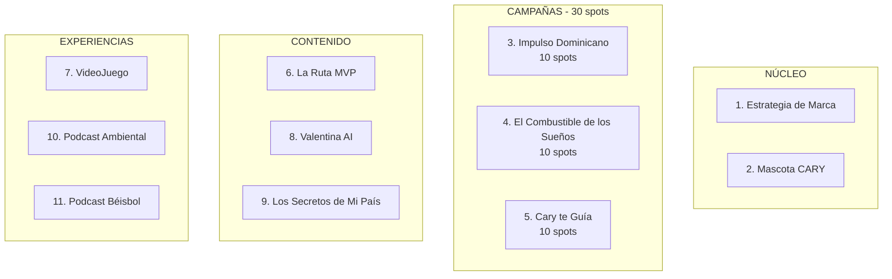

# ECOPETRÓLEO CAMPAIGN PRESENTATION WEBSITE
## Complete Specification for Sitecraft Development

---

**Project**: Ecopetróleo "Impulso Dominicano" Campaign Presentation
**Client**: Ecopetróleo Dominicana
**Agency**: Xperto MediaMax
**Purpose**: Interactive campaign presentation website for client pitch/approval
**Build Method**: Claude Code + Sitecraft Methodology

---

# 1. WEBSITE OVERVIEW

## 1.1 Objectives

| Objective | Description |
|-----------|-------------|
| **Primary** | Present the complete "Impulso Dominicano" campaign strategy to Ecopetróleo decision-makers |
| **Secondary** | Demonstrate Xperto MediaMax's creative and production capabilities |
| **Tertiary** | Serve as a living document that can be updated as production progresses |
| **Experience** | Create an immersive, cinematic experience that FEELS like the campaign |

## 1.2 Target Audience

- **Primary**: Ecopetróleo executives and marketing team
- **Secondary**: Potential investors or partners
- **Context**: Will be presented in meetings and shared as a link for review

## 1.3 Core Message

> **"Impulso Dominicano: El combustible que mueve lo nuestro."**
> 
> A comprehensive brand transformation that positions Ecopetróleo as the authentic Dominican fuel company with purpose—connecting every tank filled with the dreams and progress of the nation.

## 1.4 Website Tone

| Attribute | Expression |
|-----------|------------|
| **Cinematic** | The website should feel like watching a film—smooth, immersive, emotional |
| **Professional** | High-end agency presentation quality |
| **Warm** | Dominican warmth, not corporate coldness |
| **Confident** | Bold assertions backed by strategic thinking |
| **Aspirational** | This campaign will win awards, change perceptions, build brand value |

---

# 2. VISUAL STYLE GUIDE

## 2.1 Color Palette

### Primary Colors (Ecopetróleo Brand — Extracted from Official Logo)

| Color | Hex | RGB | Usage |
|-------|-----|-----|-------|
| **Ecopetróleo Red** | #E31837 | 227, 24, 55 | "Petróleo" text, primary CTAs, accents |
| **Ecopetróleo Blue** | #1E4D8C | 30, 77, 140 | "Eco" text, turtle icon, "¡Tu Gasolina!" tagline |
| **Ecopetróleo Green Light** | #5BBF4A | 91, 191, 74 | Logo stripes (top) |
| **Ecopetróleo Green Medium** | #00A651 | 0, 166, 81 | Logo stripes (middle) |
| **Ecopetróleo Green Dark** | #006838 | 0, 104, 56 | Logo stripes (bottom) |
| **Ecopetróleo White** | #FFFFFF | 255, 255, 255 | Backgrounds, text on dark |
| **Deep Navy** | #0D1B2A | 13, 27, 42 | Primary dark background |

**Logo Color Notes:**
- The three diagonal stripes form a gradient from light to dark green (top to bottom)
- "Eco" is in blue, "Petróleo" is in red
- The turtle mascot icon uses the same blue as "Eco"
- "¡Tu Gasolina!" tagline uses the same blue

### Campaign Colors (Impulso Dominicano)

| Color | Hex | RGB | Usage |
|-------|-----|-----|-------|
| **Dominican Gold** | #F4A460 | 244, 164, 96 | Warmth, hope, dawn/dusk |
| **Campo Green** | #228B22 | 34, 139, 34 | Nature, environment, turtle |
| **Caribbean Sky** | #87CEEB | 135, 206, 235 | Aspiration, open possibility |
| **Earth Brown** | #8B4513 | 139, 69, 19 | Baseball fields, authenticity |
| **Sunset Orange** | #FF7F50 | 255, 127, 80 | Energy, passion, triumph |

### UI Colors

| Color | Hex | Usage |
|-------|-----|-------|
| **Text Primary** | #FFFFFF | Main text on dark backgrounds |
| **Text Secondary** | #B0B0B0 | Secondary text, captions |
| **Text on Light** | #1A1A2E | Text when on white backgrounds |
| **Accent Hover** | #E63950 | Hover states for red elements |
| **Success** | #4CAF50 | Completed items, checkmarks |
| **Border Subtle** | rgba(255,255,255,0.1) | Dividers on dark backgrounds |

## 2.2 Typography

### Font Stack

```css
/* Primary - Headlines and Impact */
--font-display: 'Bebas Neue', 'Impact', sans-serif;

/* Secondary - Body and Professional Text */
--font-body: 'Montserrat', 'Helvetica Neue', sans-serif;

/* Accent - Quotes and Emotional Text */
--font-accent: 'Playfair Display', 'Georgia', serif;

/* Monospace - Data and Technical */
--font-mono: 'JetBrains Mono', 'Consolas', monospace;
```

### Type Scale

| Element | Font | Size | Weight | Letter Spacing |
|---------|------|------|--------|----------------|
| **Hero Title** | Bebas Neue | 80-120px | 400 | 0.05em |
| **Section Title** | Bebas Neue | 48-64px | 400 | 0.03em |
| **Subsection** | Montserrat | 28-36px | 600 | 0 |
| **Body Large** | Montserrat | 18-20px | 400 | 0.01em |
| **Body** | Montserrat | 16px | 400 | 0.01em |
| **Caption** | Montserrat | 14px | 400 | 0.02em |
| **Quote** | Playfair Display | 24-32px | 400 Italic | 0 |
| **Data** | JetBrains Mono | 14-16px | 400 | 0 |

### Typography Rules

1. **Headlines**: Always uppercase for Bebas Neue
2. **Body**: Sentence case, generous line height (1.6-1.8)
3. **Quotes**: Italic, with decorative quotation marks
4. **Numbers**: Use tabular figures for data alignment
5. **Spanish**: Use proper accents (á, é, í, ó, ú, ñ)

## 2.3 Imagery Style

### Photography Direction

| Aspect | Direction |
|--------|-----------|
| **Color** | Warm, golden tones. Kodak Vision3 film emulation |
| **Lighting** | Emmanuel Lubezki style—natural, golden hour, backlit |
| **Subjects** | Authentic Dominican people, not models. Real locations |
| **Composition** | Cinematic 2.39:1 or 16:9 framing |
| **Mood** | Hopeful, warm, aspirational but grounded |

### Image Treatment

```css
/* Standard image filter for consistency */
.campaign-image {
  filter: 
    saturate(1.1) 
    contrast(1.05) 
    sepia(0.05);
}

/* Hover state */
.campaign-image:hover {
  filter: 
    saturate(1.2) 
    contrast(1.1) 
    sepia(0);
}
```

### Video Placeholders

For video content not yet produced, use:
- Stylized storyboard frames
- Animated shot descriptions
- Placeholder cards with shot lists

## 2.4 Iconography

### Icon Style

| Attribute | Specification |
|-----------|---------------|
| **Style** | Line icons, 2px stroke weight |
| **Corners** | Rounded (4px radius) |
| **Size** | 24px default, 32px for feature icons |
| **Color** | Inherit from context (usually white or gold) |

### Key Icons Needed

- Turtle (Cary mascot)
- Gas pump
- Baseball
- Car/journey
- Family
- Dominican flag elements
- Play button (video)
- Check marks (completed items)
- Award/trophy
- Chart/growth
- Game controller (video game)
- Ocean wave (Cary's Voyage)
- Steam/Switch platform logos
- Map pin / location marker
- Compass / navigation
- Camera / photo (selfie spot)
- Backpack / travel
- Route / path
- Playlist / music note
- Share / social icons
- Vote / thumbs up
- Comment / speech bubble
- Download / offline
- Difficulty levels (easy, moderate, hard)
- Activity icons (swim, hike, dive, bird, eat)
- Accessibility icons (wheelchair, child, pet, senior)

## 2.5 Motion & Animation

### Animation Principles

1. **Purposeful**: Every animation should have meaning
2. **Smooth**: 60fps, easing curves, no jank
3. **Subtle**: Enhance, don't distract
4. **Cinematic**: Think film transitions, not web bounces

### Timing Functions

```css
/* Standard ease for most animations */
--ease-standard: cubic-bezier(0.4, 0.0, 0.2, 1);

/* Dramatic entrance */
--ease-dramatic: cubic-bezier(0.0, 0.0, 0.2, 1);

/* Quick exit */
--ease-exit: cubic-bezier(0.4, 0.0, 1, 1);

/* Bounce for playful elements (Cary) */
--ease-bounce: cubic-bezier(0.68, -0.55, 0.265, 1.55);
```

### Standard Durations

| Type | Duration |
|------|----------|
| **Micro** | 150ms (hovers, button states) |
| **Short** | 300ms (reveals, fades) |
| **Medium** | 500ms (section transitions) |
| **Long** | 800ms-1200ms (hero animations) |

### Scroll Animations

- **Parallax**: Subtle (0.1-0.3 factor) on background images
- **Fade-in**: Elements fade up as they enter viewport
- **Stagger**: Sequential elements animate with 100ms delays
- **Counter**: Numbers count up when section enters view

---

# 3. SITE STRUCTURE

## 3.1 Information Architecture

```
ECOPETRÓLEO: IMPULSO DOMINICANO
│
├── HOME (Hero + Overview)
│   ├── Hero Section (Cinematic intro)
│   ├── The Challenge
│   ├── The Opportunity
│   └── The Solution (Quick overview)
│
├── THE BIG IDEA
│   ├── Manifesto
│   ├── Brand Positioning
│   └── Tagline System
│
├── CAMPAIGN COMPONENTS (11 Total)
│   │
│   ├── 1. Branding Strategy: Reposicionamiento
│   │
│   ├── 2. Brand Mascot "Cary"
│   │   ├── Meet Cary (Character Profile)
│   │   ├── Applications & Uses
│   │   └── Cary Content Ecosystem
│   │
│   ├── ADVERTISING CAMPAIGNS (30 spots total)
│   │   │
│   │   ├── 3. Campaña "Impulso Dominicano" (10 spots)
│   │   │   ├── Hero Spot: "El Regreso"
│   │   │   └── Standard Spots (9)
│   │   │
│   │   ├── 4. Campaña MLB "El Combustible de los Sueños" (10 spots)
│   │   │   ├── Three Pillars Architecture
│   │   │   ├── Hero Spots (El Sábado Padre/Madre)
│   │   │   ├── Standard Spots
│   │   │   └── Production Status
│   │   │
│   │   └── 5. Mini Campaña "Cary te Guía" (10 spots)        ◄── NEW
│   │       ├── Concept: Network Positioning
│   │       └── Cary as Animated Guide
│   │
│   ├── 6. La Ruta MVP
│   │   ├── 8 Stages of the Journey
│   │   ├── Multi-format Delivery
│   │   └── Legend Quotes & Anecdotes
│   │
│   ├── 7. VideoJuego "El Viaje de Cary"
│   │   ├── Game Concept
│   │   └── Platform Strategy
│   │
│   ├── 8. Valentina AI Influencer (Social Media)
│   │   ├── Concept Overview
│   │   ├── Meet Valentina (Character)
│   │   ├── Content Strategy (5 Pillars)
│   │   ├── Brand Integration Philosophy
│   │   └── Growth Roadmap
│   │
│   ├── 9. Serie "Los Secretos de Mi País" + Platform
│   │   ├── Strategic Positioning (Michelin Model)
│   │   ├── Series: 13 Episodes
│   │   ├── Platform: Riquezas de Mi País
│   │   └── Audience Building Strategy
│   │
│   ├── PODCASTS                                             ◄── NEW
│   │   │
│   │   ├── 10. Podcast "El Planeta Cary" (12 ep/year)
│   │   │   └── Environmental content with Cary as host
│   │   │
│   │   └── 11. Podcast "Pitches y Batazos" (52 ep/year)
│   │       └── Baseball content, La Ruta MVP specials
│   │
│   └── AI CHARACTERS                                        ◄── NEW
│       ├── MLB Universe (8 characters)
│       └── Valentina Universe (6 characters)
│
├── PRODUCTION
│   ├── Xperto MediaMax Methodology
│   ├── The Five Pillars
│   ├── Production Timeline
│   └── Status Dashboard
│
├── INVESTMENT & ROI
│   ├── Investment by Component (11 items)
│   ├── Expected Impact
│   └── KPIs
│
└── APPENDIX / RESOURCES
    ├── Full Documents (downloadable)
    ├── Creative References
    └── Contact
```

## 3.2 Page-by-Page Specification

### PAGE 1: HOME / HERO

**URL**: `/` or `/home`

**Purpose**: Immediate emotional impact + overview

**Sections**:

1. **Hero Section** (Full viewport)
   - Full-screen video background or animated gradient
   - Large animated title: "IMPULSO DOMINICANO"
   - Tagline: "El combustible que mueve lo nuestro"
   - Ecopetróleo logo
   - Scroll indicator
   - Optional: Ambient sound toggle

2. **The Challenge** 
   - Bold statement about Ecopetróleo's hidden story
   - Key stats (only 100% Dominican, turtle program unknown, etc.)
   - Visual: Contrast between current state and potential

3. **The Opportunity**
   - The paradox: "Eco" company that protects turtles, and no one knows
   - Visual: Turtle + fuel pump + Dominican flag conceptual

4. **The Solution Preview**
   - Six component cards (hover to reveal)
   - Each card links to detailed section
   - "Explore the campaign" CTA

---

### PAGE 2: THE BIG IDEA

**URL**: `/big-idea`

**Purpose**: Emotional and strategic foundation

**Sections**:

1. **Manifesto** (Full-screen cinematic)
   - Animated text reveal of the manifesto
   - Optional: Voice-over audio
   - Visual: Dominican landscapes, people, baseball

2. **Brand Positioning**
   - Before/After positioning statement
   - Competitive context visualization
   - The "only" statements

3. **Tagline System**
   - Main: "Impulso Dominicano"
   - Secondary: "El combustible que mueve lo nuestro"
   - Tertiary: "Cada satisfacción empieza con un impulso"
   - Visual: How taglines appear in different contexts

---

### PAGE 3: CAMPAIGN COMPONENTS

**URL**: `/campaign`

**Purpose**: Overview of all 11 campaign elements

**Layout**: Card grid with visual hierarchy showing the ecosystem

---

#### SECTION 1: COMPONENT OVERVIEW

**Header**: "11 Componentes. Un Ecosistema. Una Visión."

**Visual Architecture Diagram (Mermaid)**:



---

#### SECTION 2: THE 11 COMPONENTS

**Components to Present (Card Grid)**:

| # | Componente | Descripción | Tipo |
|---|------------|-------------|------|
| 1 | **Estrategia de Marca: Reposicionamiento** | De "distribuidora" a "combustible con propósito" | Fundacional |
| 2 | **Mascota de la Marca: CARY** | Tortuga carey animada — rostro de la marca | Identidad |
| 3 | **Campaña "Impulso Dominicano"** | 10 spots cinematográficos + artes | Publicidad |
| 4 | **Campaña MLB "El Combustible de los Sueños"** | 10 spots + activaciones béisbol | Publicidad |
| 5 | **Mini Campaña "Cary te Guía"** | 10 spots posicionando la red de estaciones | Publicidad |
| 6 | **La Ruta MVP** | Guía de 8 etapas del pelotero dominicano | Contenido |
| 7 | **VideoJuego "El Viaje de Cary"** | Roguelike oceánico para Steam/Switch | Experiencia |
| 8 | **Valentina AI Influencer** | Presencia en redes sociales | Social |
| 9 | **Serie "Los Secretos de Mi País"** | 13 episodios + plataforma Riquezas | Contenido |
| 10 | **Podcast "El Planeta Cary"** | 12 episodios/año de conservación | Audio |
| 11 | **Podcast "Pitches y Batazos"** | 52 episodios/año de béisbol | Audio |

---

#### SECTION 3: CREATIVE PIECES SUMMARY

**Total Pieces Across Campaigns**:

| Campaña | Videos | Cutdowns | Vallas | Digital | Social Posts | Stories |
|---------|--------|----------|--------|---------|--------------|---------|
| Impulso Dominicano | 10 | 10 | 20 | 30 | 30 | 50 |
| El Combustible de los Sueños | 10 | 10 | 20 | 30 | 30 | 50 |
| Cary te Guía | 10 | 10 | 20 | 30 | 30 | 50 |
| **TOTAL** | **30** | **30** | **60** | **90** | **90** | **150** |

**Grand Total**: 450+ creative pieces

---

#### SECTION 4: COMPONENT CARDS

Each card displays:
- Component number and icon
- Title
- One-line description
- Type badge (Fundacional / Publicidad / Contenido / Experiencia / Social / Audio)
- Key deliverables count
- Link to detailed section

---

### PAGE 4: MLB CAMPAIGN DEEP DIVE

**URL**: `/mlb-campaign`

**Purpose**: Detailed presentation of "El Combustible de los Sueños"

**This is the most content-rich page — presenting the complete MLB/Baseball strategy**

---

#### SECTION 1: CAMPAIGN OVERVIEW

**The Central Insight:**
> "Detrás de cada pelotero dominicano en Grandes Ligas hay miles de galones de gasolina: los viajes a las academias, los torneos de pueblo, los padres que manejaron horas para que su hijo tuviera una oportunidad."

**Key Stats to Display:**
- 98 Dominican players on MLB Opening Day 2024 (~10% of all players)
- 5 Dominicans in the Hall of Fame
- 30 MLB teams with academies in Dominican Republic
- Baseball is the "national religion" — emotional territory to own

**Campaign Architecture Visual:**
```
╔═══════════════════════════════════════════════════════════════════════════════╗
║                     EL COMBUSTIBLE DE LOS SUEÑOS                              ║
╠═══════════════════════════════════════════════════════════════════════════════╣
║                                                                               ║
║   ┌─────────────────┐   ┌─────────────────┐   ┌─────────────────┐            ║
║   │   ACTIVACIONES  │   │   LA RUTA MVP   │   │    CONTENT      │            ║
║   │      MLB        │   │   (La Guía)     │   │    SERIES       │            ║
║   └────────┬────────┘   └────────┬────────┘   └────────┬────────┘            ║
║            │                     │                     │                      ║
║   LIDOM Sponsorship     Inspirational Guide     Mini-documentaries           ║
║   MLB Ambassadors       8 Stages of Journey     "El Viaje de..."             ║
║   Academy Partnerships  Web/Mobile/Print        10 Cinematic Spots           ║
║   Community Tournaments Video/Podcast           Social Content               ║
║                                                                               ║
╚═══════════════════════════════════════════════════════════════════════════════╝
```

---

#### SECTION 2: THE THREE PILLARS

**Pilar 1: Activaciones MLB**

| Tier | Description | Investment Est. |
|------|-------------|-----------------|
| **LIDOM Partnership** | Team sponsorship or "Jugador del Partido" | $20K-150K |
| **MLB Academy Partnership** | Alianza con 1-2 academias en RD | $30K-75K |
| **MLB Player Ambassador** | Embajador estrella dominicana | $150K-500K |
| **Community Baseball** | Torneos locales, equipamiento | $10K-25K |

**Pilar 2: La Ruta MVP** (Major Interactive Section)

*Present as expandable/interactive element*

> "El mapa completo del sueño dominicano en el béisbol"

**The 8 Stages Visual:**
```
    ┌─────────┐
    │ ETAPA 1 │ LA SEMILLA (0-8 años)
    │  🌱     │ Primer contacto con el béisbol
    └────┬────┘
         │
    ┌────▼────┐
    │ ETAPA 2 │ EL DIAMANTE EN BRUTO (9-14 años)
    │  💎     │ Desarrollo de fundamentos
    └────┬────┘
         │
    ┌────▼────┐
    │ ETAPA 3 │ LA ACADEMIA (15-18 años)
    │  🏟️     │ Entrenamiento profesional
    └────┬────┘
         │
    ┌────▼────┐
    │ ETAPA 4 │ LA FIRMA (16-21 años)
    │  ✍️     │ El contrato profesional
    └────┬────┘
         │
    ┌────▼────┐
    │ ETAPA 5 │ LAS LIGAS MENORES (18-25 años)
    │  🚌     │ El largo camino de desarrollo
    └────┬────┘
         │
    ┌────▼────┐
    │ ETAPA 6 │ EL LLAMADO (The Call-Up)
    │  📞     │ El momento que cambia todo
    └────┬────┘
         │
    ┌────▼────┐
    │ ETAPA 7 │ LA GLORIA (MLB Career)
    │  ⭐     │ Vivir el sueño
    └────┬────┘
         │
    ┌────▼────┐
    │ ETAPA 8 │ EL LEGADO (Retirement & Beyond)
    │  🏆     │ Devolver y trascender
    └─────────┘
```

**Featured Quotes (Rotating/Carousel):**
- David Ortiz: *"Mi primer bate fue un palo de escoba. Mi primera pelota fue una bola de medias. Pero el sueño... ese era del tamaño de un estadio."*
- Pedro Martínez: *"En Manoguayabo no teníamos nada, pero teníamos béisbol."*
- Juan Soto: *"El día de mi firma, lo primero que hice fue comprarle una casa a mi mamá."*
- Vladimir Guerrero Jr.: *"Mi papá lloró más que yo cuando me subieron a Grandes Ligas."*

**La Ruta MVP Formats:**
| Format | Description |
|--------|-------------|
| **Web/App** | larutamvp.com — Interactive platform |
| **PDF Guide** | 80-100 pages, downloadable |
| **Pocket Guide** | 24-32 pages for stadiums/stations |
| **Video Series** | "El Viaje de..." episodes |
| **Podcast** | Weekly interviews with legends |

**CTA**: "Descargar guía completa" → Link to la-ruta-mvp.md

---

**Pilar 3: Content Series — Spots Cinematográficos**

This section showcases the 10 cinematic spots.

---

#### SECTION 3: HERO SPOTS (Interactive showcase)

**El Sábado (Padre)**
- Synopsis, key frames, emotional beat
- Duration: 90"
- Status: Script Ready, 52 prompts

**El Sábado (Madre)**
- Synopsis, key frames, emotional beat  
- Duration: 90"
- Status: Script Ready, 52 prompts

*Visual: Side-by-side comparison showing complementary perspectives*

---

#### SECTION 4: STANDARD SPOTS (Card carousel)

| Spot | Logline | Duration | Status |
|------|---------|----------|--------|
| **Los Guantes Heredados** | Tres generaciones, un par de guantes | 60" | Script Ready |
| **El Tryout** | El día que define todo | 60" | Script Ready |
| **La Hermana Scout** | Ella lo vio primero | 45" | Script Ready |

*Each card shows: Thumbnail, logline, duration, status badge, key visual*

---

#### SECTION 5: SHORT SPOTS (Grid)

| Spot | Duration | Concept |
|------|----------|---------|
| **5:30 AM** | 30" | La madrugada del sueño |
| **El Manager** | 30" | Quien construye campeones |
| **El Pelotero Retirado** | 30" | El legado continúa |
| **La Racha** | 30" | La superstición del dominicano |

---

#### SECTION 6: DOCUMENTARY

**"Desde La Romana hasta Las Mayores"**
- Long-form documentary concept
- Structure preview
- Potential MLB player subject

---

#### SECTION 7: PRODUCTION STATUS DASHBOARD

Visual progress bars showing:
- Scripts: 10/10 complete
- Video prompts: 336 ready
- Characters: 79 designed
- Music compositions: 6 ready
- Timeline to delivery

---

#### SECTION 8: INVESTMENT SCENARIOS

| Scenario | Investment | Components |
|----------|------------|------------|
| **Entry** | $75K-125K | LIDOM "Jugador del Partido" + Torneos + La Ruta MVP digital + Basic content |
| **Intermediate** | $200K-350K | LIDOM team sponsor + Academy partnership + Full La Ruta MVP + Complete content |
| **Premium** | $500K-800K | All above + MLB Ambassador + Multi-format production |

---

#### SECTION 9: CONTENT MATRIX

Table showing all spots with:
- Title
- Type (Hero/Standard/Short)
- Duration
- Cutdown versions (60", 30", 15")
- Platform distribution (TV, Digital, Social, Stadium)

---

### PAGE 5: MASCOT & VIDEO GAME

**URL**: `/cary`

**Purpose**: Present Cary mascot and the video game—two key brand experience components

**This page has TWO major sections of equal importance:**

**Sections**:

1. **Meet Cary** (The Mascot)
   - Character introduction and backstory
   - Visual: Character design concepts (friendly sea turtle)
   - Personality traits and voice
   - Use cases (animation, stickers, merchandise, station presence)
   - Connection to real turtle conservation program

2. **CARY'S VOYAGE — The Video Game** (Major Feature)
   
   **Game Overview Card:**
   - Title: "Cary's Voyage: Guardian of the Caribbean"
   - Genre: Roguelike Ocean Adventure
   - Platforms: Steam (PC/Mac) + Nintendo Switch
   - Target: All ages, family-friendly
   
   **Gameplay Section:**
   - Core loop explanation (explore, protect, survive)
   - Visual: Concept art / mockup screenshots
   - Key features list
   - Environmental message integration (implicit, not preachy)
   
   **Why a Video Game?**
   - Brand engagement beyond traditional advertising
   - Younger audience connection
   - Long-term brand affinity building
   - PR and earned media potential
   - "A fuel company made a game about saving turtles"
   
   **Technical Specs:**
   - Development approach (indie studio partnership or internal)
   - Timeline: 12-18 months
   - Investment level indicator
   - Revenue potential (not just cost center)
   
   **Visual Mockups:**
   - Main menu concept
   - Gameplay screenshot concept
   - Character/power-up examples
   
3. **Cary Content Ecosystem**
   - How mascot and game connect
   - Station activations (Cary appears at pumps)
   - Animated shorts potential
   - Merchandise tie-ins
   - Social media presence (Cary as character account)

4. **Mini Campaign: "Cary te Guía"** (NEW)
   
   **Campaign Concept:**
   > "Siempre hay una Ecopetróleo en tu camino"
   
   **Purpose**: Position the station network as accessible and reliable, with Cary as the friendly guide
   
   **10 Spots:**
   | # | Título | Concepto |
   |---|--------|----------|
   | 1 | Bienvenido | Cary welcomes to the network |
   | 2 | Norte a Sur | National coverage |
   | 3 | La Carretera | Always near on your journey |
   | 4 | El Desvío | Finding unexpected stations |
   | 5 | Lluvia | Shelter and service |
   | 6 | Madrugada | Open when you need |
   | 7 | La Familia | Family trips |
   | 8 | El Trabajador | For early workers |
   | 9 | Fin de Semana | Weekend getaways |
   | 10 | Gracias | Customer appreciation |
   
   **Cary's Role:**
   - Animated narrator guiding viewers
   - Visual element pointing to stations
   - Character interacting with drivers (animation + live action)
   - Icon in transitions and closings
   
   **Creative Pieces:**
   - 10 video spots (30" each)
   - 10 cutdowns (15")
   - 20 billboard designs
   - 30 digital ads
   - 30 social posts
   - 50 stories

5. **Podcasts Hosted by Cary**
   
   **El Planeta Cary (Environmental)**
   - Host: Cary (animated voice) + expert guests
   - Frequency: Monthly (12 episodes/year)
   - Duration: 20-30 minutes
   - Content: Marine conservation, turtles, environment
   - Tone: Educational but accessible, not preachy

---

### PAGE 6: VALENTINA AI INFLUENCER

**URL**: `/valentina-ai`

**Purpose**: Present Valentina as a standalone AI Influencer on social media

**This is a standalone component that can:**
- Work independently as social media presence
- Serve as preparation for the video series
- Integrate with the Riquezas platform

---

#### SECTION 1: CONCEPT OVERVIEW

**The Central Idea:**

```
╔═══════════════════════════════════════════════════════════════════════════════╗
║                                                                               ║
║   VALENTINA DURÁN — @valentina.duran.rd                                       ║
║                                                                               ║
║   "Una dominicana que ama su país y lo comparte con el mundo."                ║
║                                                                               ║
║   • No es una marca. Es una persona.                                          ║
║   • No vende. Comparte.                                                       ║
║   • No promociona. Inspira.                                                   ║
║                                                                               ║
╚═══════════════════════════════════════════════════════════════════════════════╝
```

**Why an AI Influencer?**

| Advantage | Explanation |
|-----------|-------------|
| **Total control** | Message, image, values always aligned |
| **Availability** | Consistent content without talent dependency |
| **Scalability** | Can grow without time or logistics limits |
| **Innovation** | Positions Ecopetróleo as innovative brand |
| **Cost-effective** | No talent contracts, negotiations, or scandals |
| **Differentiation** | First high-profile Dominican AI influencer |

---

#### SECTION 2: MEET VALENTINA

**Character Profile Display:**
- Full name: Valentina María Durán Reyes
- Age: 27 years old
- Origin: Santiago de los Caballeros
- Residence: Santo Domingo (Zona Colonial)
- Handle: @valentina.duran.rd

**Visual**: Character design showcase with multiple poses/contexts

**Companion: Coco**
- Mixed rescue dog (Potcake)
- Her constant travel companion
- Rescued from gas station 3 years ago (natural brand connection)

**Key Personality Traits:**
- Curious: Always exploring, discovering
- Authentic: Real Dominican voice, not a character
- Adventurous: Goes where others don't
- Warm: Connects with people and places genuinely
- Proud: Of her country, without being nationalistic

---

#### SECTION 3: CONTENT STRATEGY

**The Five Content Pillars:**

| Pillar | % | Content Type |
|--------|---|--------------|
| **DISCOVER** | 40% | Hidden places, destinations, routes |
| **LIVE** | 25% | Daily life, adventures, Coco moments |
| **CONNECT** | 15% | Local people, stories, traditions |
| **INSPIRE** | 10% | Reflections, motivation, Dominican pride |
| **EDUCATE** | 10% | History, data, conservation, tips |

**Platform Priority:**
1. Instagram (Primary)
2. TikTok (Secondary)
3. YouTube Shorts (Tertiary)

**Content Frequency:**
- Instagram Feed: 4-5 posts/week
- Instagram Reels: 3-4/week
- Instagram Stories: 5-10/day
- TikTok: 5-7/week

---

#### SECTION 4: BRAND INTEGRATION PHILOSOPHY

**The Golden Rule:**

> **Valentina first. Brand second.**
> 
> Ecopetróleo is the sponsor that makes her adventures possible, not the subject of her content.

**Content Ratio:**
- 95% organic Valentina content
- 5% subtle sponsorship mentions

**Types of Integration:**

| Type | Description | Frequency |
|------|-------------|-----------|
| **Visual presence** | Ecopetróleo in background, no mention | 2-3x/week |
| **Subtle mention** | "Gracias @ecopetroleo por el impulso 💚" | 2-3x/month |
| **Declared sponsorship** | #Ad, transparent but authentic | 1-2x/month max |

**What We NEVER Do:**
- ❌ Corporate scripts
- ❌ Obvious product shots
- ❌ Aggressive calls to action
- ❌ Content that's 100% about the brand

---

#### SECTION 5: ECOSYSTEM CONNECTION

**Three Modes of Operation:**

```
MODE A: STANDALONE               MODE B: PREPARATORY              MODE C: INTEGRATED
─────────────────               ─────────────────────            ─────────────────
                                                                 
Valentina operates              Valentina builds audience         Full ecosystem:
independently                   before series launch             
                                                                 Valentina AI
• Daily social content          • Creates expectation                   │
• No series needed              • Establishes character                 ▼
• Own value as asset            • Builds follower base           Los Secretos
                                for Day 1                               │
                                                                        ▼
                                                                 Riquezas
```

**Connection Points:**
- Posts can reference "más info en Riquezas de Mi País"
- Teasers for "Los Secretos de Mi País" episodes
- Community voting for future destinations

---

#### SECTION 6: GROWTH ROADMAP

**Phase 1: Establishment (Months 1-3)**
- Launch accounts
- Daily content consistency
- Target: 10K followers

**Phase 2: Growth (Months 4-6)**
- Collaborations with RD accounts
- Viral content (reveals)
- Target: 50K followers

**Phase 3: Consolidation (Months 7-12)**
- Recognized as travel reference
- Preparation for Series launch
- Target: 150K followers

---

#### SECTION 7: INVESTMENT & DELIVERABLES

| Component | Description | Investment Est. |
|-----------|-------------|-----------------|
| **Character Development** | Final design, prompts, style guide | $5,000-10,000 |
| **Content Creation (Monthly)** | 60-80 pieces/month | $3,000-5,000/month |
| **Community Management** | Responses, engagement | $1,500-2,500/month |
| **Strategy & Reporting** | Calendar, metrics, optimization | $1,000-2,000/month |

**Total Monthly Operation**: $5,500-9,500/month
**Annual Investment**: $66,000-114,000

---

### PAGE 7: TRAVEL SERIES & PLATFORM

**URL**: `/valentina-travel`

**Purpose**: Present the video series and travel platform as the premium content ecosystem

**This is a MAJOR component with TWO integrated elements:**
1. **Los Secretos de Mi País** — The video series (13 episodes)
2. **Riquezas de Mi País** — The web/mobile platform (50+ destinations)

---

#### SECTION 1: STRATEGIC POSITIONING

**The Michelin Guide Inspiration**

| Element | Michelin Model | Valentina Model |
|---------|----------------|-----------------|
| **Authority** | Trusted restaurant ratings | Trusted destination guide |
| **Format** | Stars and reviews | Episodes and ratings |
| **Brand Halo** | Tire company → culinary authority | Fuel company → travel authority |
| **Long-term Value** | 100+ years of credibility | Building Dominican travel bible |

**Strategic Impact:**
- Positions Ecopetróleo as THE travel companion brand
- Creates owned media asset with long-term value
- Generates organic search traffic (SEO gold)
- Builds emotional connection beyond fuel transactions
- "Ecopetróleo te lleva" becomes literal truth

**Why This Works:**
> Just as Michelin—a tire company—became the world's most trusted restaurant guide, Ecopetróleo—a fuel company—can become the Dominican Republic's most trusted travel guide. The connection is natural: fuel enables journeys, and Valentina guides them.

---

#### SECTION 2: MEET VALENTINA

1. **Character Profile**
   - Full name: Valentina Durán
   - Age: 28
   - Personality: Curious, warm, adventurous, knowledgeable
   - Visual: Character design showcase
   - Voice: Confident but approachable, storyteller
   
2. **Her Companion: Coco**
   - Breed: Mixed rescue dog
   - Personality: Loyal, photogenic, travel-ready
   - Role: Emotional anchor, relatability
   
3. **Her Vehicle**
   - Always fueled at Ecopetróleo (natural integration)
   - Practical SUV suitable for Dominican roads
   - Becomes recognizable brand element

---

#### SECTION 3: SERIES CONCEPT — "LOS SECRETOS DE MI PAÍS"

**Format:**
- 13 episodes per season
- 20-25 minutes per episode
- Cinematic quality, documentary style
- Available on YouTube, TikTok (clips), Instagram (reels), and dedicated platform

**The 13 Episodes (Season 1):**

| # | Title | Destination | Region | Category |
|---|-------|-------------|--------|----------|
| 1 | El Hoyo del Volcán | El Mogote | Cibao | Montaña |
| 2 | El Pueblo que el Tiempo Olvidó | San José de las Matas | Cibao | Pueblo |
| 3 | La Catedral del Mar | Cueva de las Golondrinas | Samaná | Cueva |
| 4 | El Río que Nace del Cielo | Salto Aguas Blancas | Constanza | Cascada |
| 5 | La Isla de los Náufragos | Cayo Arena | Puerto Plata | Isla |
| 6 | El Valle de los Colores | Valle Nuevo | Cordillera Central | Valle |
| 7 | Los Fantasmas de las Salinas | Salinas de Baní | Sur | Paisaje |
| 8 | El Secreto de los Taínos | Cuevas del Pomier | Sur | Cueva |
| 9 | El Pueblo Bajo el Agua | Lago Enriquillo | Suroeste | Lago |
| 10 | La Montaña Sagrada | Pico Duarte | Cordillera Central | Montaña |
| 11 | Los Guardianes del Arrecife | La Caleta | Sur | Submarino |
| 12 | El Año de los Secretos | Retrospectiva | Nacional | Especial |
| **13** | **El Río que Se Esconde** | **Río Partido y Cascadas** | **Norte** | **Season Finale** |

**Episode Structure:**
Each episode includes:
- Video content (20-25 min)
- Dedicated page on Riquezas de Mi País platform
- Interactive map integration
- Downloadable travel guide
- Curated playlists for the journey
- CTA: "Planifica tu viaje en Riquezas de Mi País"

---

#### SECTION 4: WEB & MOBILE PLATFORM — "RIQUEZAS DE MI PAÍS"

**This is NOT just a video series—it's a full travel platform**

**The Two-Component Ecosystem:**

| Component | Los Secretos (Serie) | Riquezas (Plataforma) |
|-----------|----------------------|------------------------|
| **Content** | 13 episodes/year | 50+ destinations |
| **Format** | Video 20-25 min | Web/mobile interactive |
| **Tone** | Emotional, narrative | Practical, useful |
| **Update** | Monthly | Continuous |
| **User Action** | Watch, share | Plan, explore, share |

**Platform Objectives:**

| Objective | Implementation |
|-----------|----------------|
| **Extend experience** | Web/mobile extends beyond video |
| **Enable sharing** | Social sharing, postcards, challenges |
| **Dominate search** | SEO-optimized destination pages |
| **Sustain engagement** | User participation, voting, comments |

---

##### 4.1 USER INTERACTIVITY FEATURES

**Suggest & Vote:**
- Users can suggest new destinations
- Community votes on next episodes
- "Valentina's Choice" vs "People's Choice" episodes
- Leaderboard of most-requested destinations

**Comment & Discuss:**
- Episode discussion threads
- Destination tips from real visitors
- Photo sharing from community visits
- "I went because of Valentina" stories

**Share & Spread:**
- One-click social sharing
- Custom postcards with destination photos
- "I discovered [Destination] with Valentina" frames
- Challenge: Visit and share your own video

---

##### 4.2 TRAVEL GUIDES SECTION

**Complete Guide Library:**

| Guide Type | Content |
|------------|---------|
| **Episode Guides** | Detailed guide for each of the 13 destinations |
| **Regional Guides** | Norte, Sur, Este, Suroeste, Cibao, Samaná |
| **Country Guide** | Complete Dominican Republic travel bible |
| **Thematic Guides** | Playas, Montañas, Cascadas, Parques Nacionales |

**"Guía Valentina" Branding:**
- Distinct visual identity
- Printable PDF versions
- Mobile-optimized reading
- Offline access capability

---

##### 4.3 VALENTINA'S TRAVEL RECOMMENDATIONS

**A. Preparativos para el Viaje**

| Category | Content |
|----------|---------|
| **Investigar y Preparar la Ruta** | Planning checklist, time estimates |
| **Qué Empacar** | Packing lists by destination type |
| **Preparar el Vehículo** | Pre-trip vehicle checklist |
| **Estimar el Combustible** | Distance calculator + Ecopetróleo station finder |
| **Botiquín y Esenciales** | First aid, repellent, sunscreen, eye drops |

**B. Viajar con Niños**

| Category | Content |
|----------|---------|
| **Actividades sin Pantalla** | Games, songs, I-spy, storytelling |
| **Actividades con Dispositivos** | Approved apps, educational content |
| **Paradas para el Baño** | Rest stop recommendations by route |
| **Snacks Adecuados** | Healthy, mess-free travel snacks |
| **Thermos y Lonchera** | Food prep recommendations |
| **Accesorios Niños** | Sunscreen, hats, entertainment |

**C. Playlists Recomendados**

| Genre | Mood | Integration |
|-------|------|-------------|
| **Pop** | Upbeat, sing-along | Spotify/Apple Music links |
| **Urbano** | Dominican reggaeton, dembow | Curated Dominican artists |
| **Latino** | Salsa, merengue, bachata | Classic road trip vibes |
| **Clásico y Jazz** | Relaxed, scenic | Sunset drives |
| **Clásicos Pop y Rock** | Nostalgic, family-friendly | Multi-generational appeal |

---

##### 4.4 DESTINATION INFORMATION STRUCTURE

**Each destination page includes:**

**A. Overview del Destino**
- Description and highlights
- Region and province
- Hashtags for social sharing
- Hero image/video

**B. Datos Curiosos e Interesantes**

| Category | Examples |
|----------|----------|
| **Fun Facts** | Surprising, shareable tidbits |
| **Historia** | Historical significance |
| **Cultura** | Cultural relevance and traditions |
| **Naturaleza** | Environmental and scientific importance |

**C. Clasificación del Destino**

| Attribute | Options |
|-----------|---------|
| **Categoría** | Río, Playa, Montaña, Cascada, Cueva, Parque, Isla, etc. |
| **Dificultad** | Fácil, Moderado, Difícil, Experto |
| **Acceso** | Directo, Caminata Corta, Caminata Extensa |
| **Duración** | Medio día, Día completo, Requiere pernoctar |
| **Pernoctación** | Opcional, Recomendada, Requerida |
| **Actividades** | Icons for swimming, hiking, diving, birding, etc. |

**D. Requisitos Especiales**

| Requirement | Detail |
|-------------|--------|
| **Calzado** | Tenis, botas de hiking, sandalias de agua |
| **Ropa** | Casual, deportiva, traje de baño |
| **Equipamiento** | Snorkel, linterna, bastón de senderismo |
| **Permisos** | Entrada a parques, reservaciones |
| **Reservación** | Necesaria, recomendada, no necesaria |

**E. Accesibilidad**

| Consideration | Rating |
|---------------|--------|
| **Movilidad Limitada** | ✓ Accesible / ⚠ Limitado / ✗ No accesible |
| **Niños** | Edades recomendadas |
| **Adultos Mayores** | Consideraciones específicas |
| **Mascotas** | Permitidas, restricciones |

---

##### 4.5 ACTIVIDADES EN EL DESTINO

**Qué Hacer:**
- Curated activity list
- Time recommendations
- Cost estimates
- Booking links where applicable

**El Lugar del Selfie:**
- Best photo spots marked on map
- Suggested poses/angles
- Hashtag suggestions

**Cómo Contribuir:**
- Conservation tips
- Leave-no-trace guidelines
- Local community support options

**Postal Interactiva:**
- Generate custom postcard with your photo
- Share to social media
- Email to friends/family

---

##### 4.6 ACCESO AL DESTINO

**A. Preparación del Viaje**
- Checklist específico del destino
- Best time to visit
- Weather considerations

**B. Mapa Interactivo**
- Embedded Google Maps
- Custom markers for points of interest
- Ecopetróleo stations highlighted

**C. Rutas Pre-Preparadas por Valentina**

| Origen | Disponible |
|--------|------------|
| Santo Domingo | ✓ |
| Santiago | ✓ |
| La Vega | ✓ |
| Puerto Plata | ✓ |
| San Pedro de Macorís | ✓ |
| San Francisco de Macorís | ✓ |
| La Romana | ✓ |
| Barahona | ✓ |
| Punta Cana | ✓ |
| Samaná | ✓ |
| Higüey | ✓ |

**Each Route Includes:**
- Turn-by-turn suggestions
- Estimated time and fuel
- Paradas interesantes en el camino
- Paradas necesarias (baños, snacks)
- **Estaciones Ecopetróleo en la ruta** (key brand integration)

**D. Itinerario Completo**
- Ida (departure to destination)
- Estancia (activities at destination)
- Regreso (return journey, different route option)

**E. Playlist del Episodio**
Each destination has curated playlists:
- Pop
- Urbano
- Latino
- Clásico y Jazz
- Clásicos del Pop y Rock

---

#### SECTION 5: EPISODE DEEP DIVE — RÍO PARTIDO Y SUS CASCADAS

**Episode 13: Season Finale — "El Río que Se Esconde"**

| Attribute | Detail |
|-----------|--------|
| **Episode Number** | 13 (Season Finale) |
| **Title** | El Río que Se Esconde |
| **Nombre** | Río Partido y sus Cascadas |
| **Región** | Norte (Provincia Espaillat) |
| **Categoría** | Río / Cascada |
| **Dificultad** | ⭐⭐ Moderada |
| **Duración** | 22-25 minutos |
| **Tono** | Misterioso, revelador, celebratorio |

**Episode Synopsis:**
Valentina concludes Season 1 with a hidden gem: Río Partido, where the river literally "splits" around a massive rock formation, creating a series of stunning cascades. She reflects on a year of discoveries while exploring why locals have guarded this spot as their secret swimming hole for generations.

**Key Moments:**
- Cold Open: Drone shot of river splitting
- The journey from Santiago (stop at Ecopetróleo Moca)
- Meeting Don Ramón (65 years), local who's known it since childhood
- Swimming under the cascades with Coco
- Season reflection: "Trece secretos. Trece aventuras. Trece razones para amar este país."
- Teaser: "Temporada 2 — Próximamente"

**Visual Showcase:**
- Episode thumbnail concept
- Key scenes preview
- Behind-the-scenes with Valentina
- Map showing all 13 Season 1 destinations

---

#### SECTION 6: AUDIENCE BUILDING STRATEGY

**Growth Projection:**

| Phase | Timeline | Goal |
|-------|----------|------|
| **Launch** | Months 1-3 | 10K followers, 3 episodes |
| **Growth** | Months 4-8 | 50K followers, 8 episodes |
| **Authority** | Months 9-12 | 100K followers, all episodes |
| **Evergreen** | Year 2+ | Continuous growth, new seasons |

**Platform Strategy:**

| Platform | Content Type | Frequency |
|----------|--------------|-----------|
| **YouTube** | Full episodes | 2-3/month |
| **TikTok** | Clips, teasers, BTS | Daily |
| **Instagram** | Reels, photos, stories | Daily |
| **Web/App** | Full platform | Continuous |

**Brand Integration (Natural, Not Forced):**
- Valentina fuels at Ecopetróleo (visual, not verbal)
- Route maps show Ecopetróleo stations
- "Fuel your adventure" subtle messaging
- Turtle conservation tie-in when appropriate

---

#### SECTION 7: PLATFORM TECHNICAL SPECS

**Web Requirements:**
- Responsive design (mobile-first)
- Interactive maps (Google Maps API)
- Video embedding (YouTube/custom player)
- Social sharing integration
- User accounts (optional, for voting/commenting)
- SEO optimization for each destination

**Mobile App (Future Phase):**
- iOS and Android
- Offline guide access
- GPS-enabled route guidance
- Push notifications for new episodes
- Ecopetróleo station locator

---

### PAGE 8: PRODUCTION METHODOLOGY

**URL**: `/production`

**Purpose**: Explain HOW we create this (Xperto MediaMax value prop)

**Sections**:

1. **The Five Pillars** (Animated reveal)
   - Higher Quality
   - Half the Cost
   - In a Third of the Time
   - Total Control
   - Infinite Possibilities

2. **Technology Stack**
   - AI tools used (Veo, MidJourney, Suno, Claude)
   - Human + AI collaboration model
   - Quality control process

3. **The Team**
   - Xperto MediaMax introduction
   - Virtual crew concept
   - Past work examples (35 Days of Magic reference)

4. **AI Characters Universe** (NEW)
   
   **Why AI Characters:**
   - Total control over age, emotion, activity, wardrobe
   - Always available, no scheduling conflicts
   - Consistent appearance over time
   - No talent fees or contract negotiations
   - Zero reputational risk
   
   **MLB Universe (8 Characters):**
   | Personaje | Rol | Descripción |
   |-----------|-----|-------------|
   | Rafael | El Padre | 42, dedicated worker, dreams of son's success |
   | Carmen | La Madre | 40, strong family pillar, unconditional support |
   | Miguel | El Hijo | 14, baseball prospect, talented and disciplined |
   | Sofía | La Hermana | 17, first to see Miguel's talent |
   | Don Manolo | El Abuelo | 68, ex-amateur player, transmits wisdom |
   | Ramón | Operador de Estación | 50, knows everyone, witness to stories |
   | José | Manager de MiniLiga | 55, talent builder, dedicated to youth |
   | Mario | Jugador Retirado | 60, reached AAA, gives back to community |
   
   **Valentina Universe (6 Characters):**
   | Personaje | Rol | Descripción |
   |-----------|-----|-------------|
   | Valentina | Protagonista | 27, curious, adventurous, proudly Dominican |
   | Coco | El Perro | Rescued potcake, loyal travel companion |
   | Dani | Amiga Fotógrafa | 26, captures moments, occasional travel buddy |
   | Marcos | Guía Ambiental | 35, nature expert |
   | Doña Carmen | Mentora Cultural | 65, tradition guardian, storyteller |
   | Chichí | Despachador de Estación | 45, knows all the roads, always has a tip |
   
   **Visual**: Character gallery with consistent visual design

5. **Production Timeline**
   - Visual Gantt-style timeline
   - Milestones
   - Delivery dates

6. **Podcasts Production** (NEW)
   
   **El Planeta Cary** (Environmental)
   - Host: Cary (animated voice) + expert guests
   - 12 episodes/year, 20-30 minutes each
   - Content: Marine conservation, turtles, environment
   
   **Pitches y Batazos** (Baseball)
   - Host: Sports commentator + guests
   - 52 episodes/year, 45-60 minutes each
   - Content: Dominican baseball, MLB, stories
   - Special episodes: La Ruta MVP deep dives

---

### PAGE 9: INVESTMENT & ROI

**URL**: `/investment`

**Purpose**: Business case and investment breakdown by component

**Sections**:

1. **Investment by Component**

   | # | Componente | Inversión |
   |---|------------|-----------|
   | 1 | Estrategia de Marca: Reposicionamiento | US$12,500 |
   | 2 | Mascota de la Marca: CARY | US$15,000 |
   | 3 | Campaña de Anuncios: Impulso Dominicano (10 spots + artes) | US$45,000 |
   | 4 | Campaña MLB: El Combustible de los Sueños (10 spots + artes) | US$45,000 |
   | 5 | Mini Campaña: Cary te Guía (10 spots + artes) | US$35,000 |
   | 6 | La Ruta MVP (multi-formato) | US$25,000 |
   | 7 | VideoJuego: El Viaje de Cary | US$8,500 |
   | 8 | Valentina AI Influencer (12 meses) | US$85,000 |
   | 9 | Serie: Los Secretos de Mi País (13 episodios) | US$65,000 |
   | 10 | Podcast: El Planeta Cary (12 episodios) | US$12,000 |
   | 11 | Podcast: Pitches y Batazos (52 episodios) | US$32,000 |
   | | **SUBTOTAL PRODUCCIÓN** | **US$380,000** |
   
   **Variable Components:**
   | Item | Rango |
   |------|-------|
   | Activaciones MLB | US$60,000 - 350,000 |
   | Medios (12 meses) | US$200,000 - 500,000 |

2. **Creative Pieces Total**
   - 30 video spots (three campaigns)
   - 30 cutdowns (15" versions)
   - 60 vallas/billboards
   - 90 digital ads
   - 90 social posts
   - 150 stories
   - **450+ pieces total**

3. **Expected Impact**
   - Business metrics (+10-15% traffic)
   - Communication metrics (Top 5 recall)
   - Cultural impact (National conversation)
   - Award potential (Effie, Cannes, Webby)

4. **KPIs & Measurement**
   - How we'll measure success
   - Reporting cadence
   - Benchmark targets

---

### PAGE 10: RESOURCES / APPENDIX

**URL**: `/resources`

**Purpose**: Access to full documents and contact

**Sections**:

1. **Document Library**
   - All PDFs/documents downloadable
   
   **Strategy Documents:**
   - Brand Brief
   - Creative Proposal (v2.0 — 11 components)
   - Commercial Proposal
   
   **Advertising Campaigns (30 spots total):**
   - Campaña Impulso Dominicano (10 spot scripts + artes)
   - Campaña El Combustible de los Sueños (10 spot scripts + artes)
   - Mini Campaña Cary te Guía (10 spot scripts + artes)
   
   **MLB Campaign:**
   - El Combustible de los Sueños (Campaign Strategy)
   - **La Ruta MVP** (Complete Guide — 8 Stages)
   - Production Lookbook
   
   **Mascot & Game:**
   - Cary Character Bible
   - VideoJuego El Viaje de Cary (Game Design Document)
   
   **Valentina & Travel:**
   - **Valentina AI Influencer** (Social Media Strategy)
   - Los Secretos de Mi País (Series Bible — 13 episodes)
   - Riquezas de Mi País (Platform Specification)
   
   **Podcasts:**
   - El Planeta Cary (Series Bible — 12 episodes)
   - Pitches y Batazos (Series Bible — 52 episodes)
   
   **AI Characters:**
   - MLB Universe Characters (8 profiles)
   - Valentina Universe Characters (6 profiles)
   
   **Production:**
   - Character Reference Library
   - MidJourney Prompt Guides
   - Technical Specifications

2. **Creative References**
   - Film references
   - Visual mood boards
   - Music direction

3. **Contact**
   - Xperto MediaMax contact info
   - Next steps CTA
   - Meeting scheduler

---

# 4. COMPONENT SPECIFICATIONS

## 4.1 Navigation

### Primary Navigation (Fixed Header)

```
Logo [Impulso Dominicano] | Home | Big Idea | Components | Campaigns | Valentina | Travel | Production | Investment | [Contact CTA]
```

**Navigation Notes:**
- "Components" → Overview of all 11 components (Page 3)
- "Campaigns" → Dropdown: Impulso Dominicano | El Combustible de los Sueños | Cary te Guía
- "Cary" → Mascot, Game, Mini Campaign, Podcasts (Page 5)
- "Valentina" → AI Influencer social media (Page 6)
- "Travel" → Los Secretos + Riquezas de Mi País (Page 7)
- "Production" → Methodology, AI Characters, Podcasts (Page 8)

**Behavior**:
- Fixed on scroll
- Transparent over hero, solid on scroll
- Hamburger on mobile (< 768px)
- Active state: underline animation

### Mobile Navigation

- Full-screen overlay
- Large touch targets (44px min)
- Animated reveal (stagger)
- Close button prominent

## 4.2 Hero Component

**Structure**:
```html
<section class="hero">
  <div class="hero-background">
    <!-- Video or animated gradient -->
  </div>
  <div class="hero-content">
    
    <h1 class="hero-title">IMPULSO DOMINICANO</h1>
    <p class="hero-tagline">El combustible que mueve lo nuestro</p>
    <div class="hero-cta">
      <button>Explorar la campaña</button>
    </div>
  </div>
  <div class="scroll-indicator">
    <!-- Animated scroll arrow -->
  </div>
</section>
```

**Animation Sequence**:
1. Background fades in (0-500ms)
2. Logo scales up (500-1000ms)
3. Title types in letter by letter (1000-2000ms)
4. Tagline fades up (2000-2500ms)
5. CTA slides up (2500-3000ms)
6. Scroll indicator pulses (loop)

## 4.3 Section Headers

**Pattern**:
```html
<header class="section-header">
  <span class="section-number">01</span>
  <h2 class="section-title">THE BIG IDEA</h2>
  <p class="section-subtitle">La plataforma estratégica</p>
</header>
```

**Style**:
- Number: Gold, monospace, small
- Title: Bebas Neue, uppercase, large
- Subtitle: Montserrat, sentence case, muted

## 4.4 Card Components

### Campaign Component Card

```html
<article class="campaign-card">
  <div class="card-image">
    
    <div class="card-overlay">
      <span class="card-status">✓ Complete</span>
    </div>
  </div>
  <div class="card-content">
    <h3 class="card-title">MLB Campaign</h3>
    <p class="card-description">10 spots cinematográficos...</p>
    <div class="card-meta">
      <span class="investment">US$60K</span>
      <span class="timeline">12 semanas</span>
    </div>
  </div>
  <a href="/mlb-campaign" class="card-link">Ver detalles →</a>
</article>
```

### Spot Preview Card

```html
<article class="spot-card">
  <div class="spot-thumbnail">
    <!-- Storyboard frame or placeholder -->
  </div>
  <div class="spot-info">
    <span class="spot-type">Hero Spot</span>
    <h4 class="spot-title">El Sábado (Padre)</h4>
    <p class="spot-logline">Un padre lleva a su hijo...</p>
    <div class="spot-specs">
      <span>90"</span>
      <span>52 prompts</span>
      <span class="status complete">Script Ready</span>
    </div>
  </div>
</article>
```

## 4.5 Progress/Status Components

### Progress Bar

```html
<div class="progress-item">
  <div class="progress-label">
    <span>Scripts Completed</span>
    <span>5/10</span>
  </div>
  <div class="progress-bar">
    <div class="progress-fill" style="width: 50%"></div>
  </div>
</div>
```

### Status Badge

```html
<span class="status-badge complete">✓ Complete</span>
<span class="status-badge in-progress">⏳ In Progress</span>
<span class="status-badge pending">○ Pending</span>
```

## 4.6 Manifesto Component

**Full-screen text reveal with cinematic treatment**

```html
<section class="manifesto">
  <div class="manifesto-background">
    <!-- Subtle video or parallax images -->
  </div>
  <div class="manifesto-text">
    <p class="manifesto-line" data-delay="0">
      Hay un país que avanza.
    </p>
    <p class="manifesto-line" data-delay="500">
      Una familia que madruga.
    </p>
    <!-- ... more lines ... -->
  </div>
</section>
```

**Behavior**: Lines fade/slide in as user scrolls or with timed animation.

## 4.7 Video Player Component

For video content (when available):

```html
<div class="video-player">
  <div class="video-container">
    <!-- Actual video or placeholder -->
    <div class="video-placeholder">
      
      <div class="play-overlay">
        <button class="play-button">▶</button>
        <span>Coming Soon</span>
      </div>
    </div>
  </div>
  <div class="video-info">
    <h4>El Sábado (Padre)</h4>
    <p>90" Hero Spot | Production Ready</p>
  </div>
</div>
```

## 4.8 Investment Toggle

Interactive component to switch between investment scenarios:

```html
<div class="investment-toggle">
  <button class="toggle-option" data-tier="minimum">Mínimo</button>
  <button class="toggle-option active" data-tier="recommended">Recomendado</button>
  <button class="toggle-option" data-tier="maximum">Máximo</button>
</div>

<div class="investment-content">
  <!-- Content changes based on selection -->
</div>
```

---

# 5. CONTENT GUIDE

## 5.1 Key Messages Per Section

### Home / Hero

**Primary Message**: "Ecopetróleo is about to become the most meaningful fuel brand in the Dominican Republic."

**Supporting Points**:
- Only 100% Dominican fuel company with national scale
- Real environmental program (turtle protection)
- Untold story ready to be told

### The Big Idea

**Primary Message**: "Impulso Dominicano connects every tank filled with the progress of a nation."

**Manifesto** (Full text to animate):
```
Hay un país que avanza.
Una familia que madruga.
Un sueño que viaja por carretera.
Un pelotero que sale de un campo de tierra
y llega a las Grandes Ligas.

Hay un tanque que se llena.
Y un impulso que no se detiene.

Porque en cada galón de Ecopetróleo
no solo hay combustible—
hay el mismo fuego que mueve a un país entero.

Somos la única empresa de combustible
100% dominicana con alcance nacional.
Somos los que protegen las tortugas
mientras movemos a las familias.
Somos el impulso detrás del progreso.

IMPULSO DOMINICANO.
El combustible que mueve lo nuestro.
```

### MLB Campaign

**Primary Message**: "Baseball is not a sport in the DR—it's the national dream. This campaign owns that emotional territory through three integrated pillars."

**The Central Insight:**
> "Detrás de cada pelotero dominicano en Grandes Ligas hay miles de galones de gasolina."

**The Three Pillars:**
1. **Activaciones MLB** — LIDOM, academies, ambassadors, community
2. **La Ruta MVP** — The complete 8-stage journey guide
3. **Content Series** — 10 cinematic spots + documentary

**Key Stats to Display**:
- 10 cinematic spots
- ~336 video prompts ready
- 79 character reference images
- 6 original music compositions
- 8 stages in La Ruta MVP guide
- Festival-quality production standards

### Production Methodology

**Primary Message**: "Higher Quality. Half the Cost. In a Third of the Time. Total Control. Infinite Possibilities."

**Proof Points**:
- 35 Days of Magic (Juguetón precedent)
- AI + Human collaboration model
- Award-winning standards (Sundance, Cannes, Oscar-worthy)
- 14 AI characters with total control
- 2 podcast series
- Festival-quality production standards

### Investment

**Primary Message**: "This isn't an expense—it's an investment in becoming a brand with meaning."

**Key Numbers**:
- Production Subtotal: US$380,000 (11 components)
- Variable: Activaciones MLB US$60K-350K
- Variable: Medios US$200K-500K

**Components Delivered**:
- 11 integrated components
- 30 video spots (3 campaigns)
- 450+ creative pieces total
- 14 AI characters
- 2 podcasts (64 episodes/year)
- 1 video game

## 5.2 Voice and Tone Guidelines

### DO:

| Attribute | Example |
|-----------|---------|
| **Bold** | "This will transform how Dominicans see your brand." |
| **Specific** | "10 spots, 336 prompts, 79 character designs." |
| **Emotional** | "Every tank filled becomes fuel for someone's dream." |
| **Confident** | "This campaign will win awards." |
| **Dominican** | Use authentic phrases, local references |

### DON'T:

| Avoid | Why |
|-------|-----|
| Corporate jargon | Feels cold, not Dominican |
| Vague claims | "Best in class" means nothing |
| Apologies | "We hope you like..." lacks confidence |
| Over-explanation | Trust the visuals |
| English-first | Spanish is primary, but accessible |

### Language Notes

- **Primary language**: Spanish
- **English acceptable**: For technical/production terms
- **Bilingual option**: Consider language toggle
- **Accents**: Always use proper Spanish accents

---

# 6. RESPONSIVE SPECIFICATIONS

## 6.1 Breakpoints

```css
/* Mobile first approach */
--bp-mobile: 320px;   /* Base */
--bp-tablet: 768px;   /* Tablet portrait */
--bp-laptop: 1024px;  /* Small laptop */
--bp-desktop: 1280px; /* Standard desktop */
--bp-wide: 1536px;    /* Wide screens */
```

## 6.2 Layout Behavior

| Component | Mobile | Tablet | Desktop |
|-----------|--------|--------|---------|
| **Navigation** | Hamburger | Hamburger | Full horizontal |
| **Hero** | Stack vertical | Stack vertical | Centered |
| **Card Grid** | 1 column | 2 columns | 3-4 columns |
| **Manifesto** | Smaller text | Medium | Full cinematic |
| **Tables** | Horizontal scroll | 2-col stack | Full width |
| **Video** | 16:9 full width | 16:9 contained | Cinematic 2.39:1 |

## 6.3 Touch Considerations

- Minimum touch target: 44x44px
- Swipeable carousels on mobile
- No hover-only interactions
- Larger text for readability

---

# 7. TECHNICAL REQUIREMENTS

## 7.1 Performance

| Metric | Target |
|--------|--------|
| **First Contentful Paint** | < 1.5s |
| **Largest Contentful Paint** | < 2.5s |
| **Time to Interactive** | < 3s |
| **Cumulative Layout Shift** | < 0.1 |

## 7.2 Image Optimization

- Use WebP with JPEG fallback
- Lazy loading for below-fold images
- Responsive images with srcset
- Video: compressed MP4, lazy loaded

## 7.3 Accessibility

- WCAG 2.1 AA compliance target
- Semantic HTML structure
- Keyboard navigation support
- Sufficient color contrast (4.5:1 minimum)
- Alt text for all meaningful images
- Skip navigation link

## 7.4 Browser Support

- Chrome (last 2 versions)
- Safari (last 2 versions)
- Firefox (last 2 versions)
- Edge (Chromium)
- iOS Safari (last 2 versions)
- Android Chrome (last 2 versions)

---

# 8. ASSETS REQUIRED

## 8.1 Images Needed

| Asset | Purpose | Size | Format |
|-------|---------|------|--------|
| **Ecopetróleo Logo** | Header, footer, hero | SVG | Vector |
| **Impulso Dominicano Logo** | Campaign identity | SVG | Vector |
| **Turtle Icon** | Mascot representation | SVG | Vector |
| **Hero Background** | Home hero section | 1920x1080 min | Video/WebP |
| **Campaign Component Thumbnails** | Card images | 800x600 | WebP |
| **Spot Storyboard Frames** | Video placeholders | 1920x800 | WebP |
| **Character Portraits** | MLB campaign section | 600x800 | WebP |
| **Dominican Landscapes** | Background/decoration | Various | WebP |
| **Valentina Character** | AI Influencer section | 600x800 | WebP |
| **Valentina + Coco** | Character showcase | 800x600 | WebP |
| **Valentina's Vehicle** | Travel platform | 800x450 | WebP |
| **Dominican Map Illustrated** | Episode guide | 1200x900 | SVG/WebP |
| **Destination Thumbnails (13)** | Episode cards | 800x450 | WebP |
| **Río Partido Featured** | New episode showcase | 1920x1080 | WebP |
| **Travel Platform UI Mockup** | Platform section | 1920x1080 | WebP |
| **Route Map Example** | Destination pages | 800x600 | WebP |
| **Cary Character** | Mascot section | 600x600 | WebP/SVG |
| **Cary's Voyage Logo** | Video game section | SVG | Vector |
| **Game Concept Art** | Video game section | 1920x1080 | WebP |
| **Game UI Mockup** | Video game showcase | 1920x1080 | WebP |
| **Game Character Sprites** | Video game section | Various | WebP/PNG |
| **Team Photos** | Production section | 400x400 | WebP |

## 8.2 Icons Needed

- Navigation icons (menu, close, arrow)
- Social media icons
- Status icons (check, clock, circle)
- Component icons (video, music, game, etc.)
- Play button
- Download icon
- External link icon

## 8.3 Videos Needed

| Video | Purpose | Duration | Priority |
|-------|---------|----------|----------|
| **Hero Background** | Home page ambiance | 15-30s loop | High |
| **Manifesto Visual** | Big Idea section | 60s | Medium |
| **Spot Teasers** | When produced | 15-30s each | Future |

## 8.4 Documents for Download

- Brand Brief (PDF)
- Creative Proposal (PDF)
- Commercial Proposal (PDF)
- Production Lookbook (PDF)
- Individual Spot Scripts (PDF)
- Investment Summary (PDF)

---

# 9. INTERACTION SPECIFICATIONS

## 9.1 Scroll Behaviors

| Element | Behavior |
|---------|----------|
| **Hero** | Parallax background (subtle) |
| **Section headers** | Fade in + slide up on enter |
| **Cards** | Stagger fade in (100ms delay each) |
| **Progress bars** | Animate fill on enter |
| **Numbers** | Count up animation on enter |
| **Manifesto lines** | Sequential reveal on scroll |

## 9.2 Hover States

| Element | Hover Effect |
|---------|--------------|
| **Navigation links** | Underline animation |
| **Cards** | Lift (translateY -8px) + shadow |
| **Buttons** | Background color shift |
| **Images** | Slight scale (1.02) + filter change |
| **Links** | Color to gold |

## 9.3 Click/Tap Actions

| Element | Action |
|---------|--------|
| **Logo** | Return to home |
| **Campaign cards** | Navigate to detail page |
| **Video placeholders** | Open modal or expand |
| **Investment toggle** | Switch displayed content |
| **Document links** | Download PDF |
| **Contact CTA** | Open contact form or mailto |

---

# 10. IMPLEMENTATION NOTES FOR SITECRAFT

## 10.1 Component Priority

Build in this order:
1. Navigation (header + mobile)
2. Hero section
3. Section header pattern
4. Card components
5. Content sections
6. Footer
7. Animations
8. Responsive adjustments

## 10.2 Key Technical Decisions

| Decision | Recommendation |
|----------|----------------|
| **Framework** | React or vanilla JS (your preference) |
| **Styling** | CSS custom properties + Tailwind or custom |
| **Animation** | GSAP or Framer Motion |
| **Scroll** | Intersection Observer for reveals |
| **Routing** | Single page or static pages (your call) |

## 10.3 Content Management

For easy updates:
- Keep all text content in a separate JSON/data file
- Keep status/progress data updatable
- Consider CMS integration for future

## 10.4 Testing Checklist

- [ ] All pages load correctly
- [ ] Navigation works on all devices
- [ ] Animations perform smoothly
- [ ] Images load lazily
- [ ] Videos play correctly
- [ ] Downloads work
- [ ] Contact form functions
- [ ] Responsive at all breakpoints
- [ ] Accessible via keyboard
- [ ] Cross-browser tested

---

# 11. APPENDIX: COPY BLOCKS

## 11.1 Section Headlines

```
HOME:
- "El combustible que mueve lo nuestro"
- "Una marca dominicana con propósito"

BIG IDEA:
- "Impulso Dominicano"
- "Más que combustible, movimiento"

MLB CAMPAIGN:
- "El Combustible de los Sueños"
- "10 historias que merecen un Oscar"

MASCOT:
- "Conoce a Cary"
- "El corazón de la marca"

VIDEO GAME:
- "Cary's Voyage"
- "Un videojuego que cuenta nuestra historia"
- "Aventura, protección, y el mar Caribe"

AI INFLUENCER & TRAVEL PLATFORM:
- "Valentina Durán"
- "Los Secretos de Mi País"
- "Tu guía de viajes dominicana"
- "Como Michelin, pero para viajar"
- "13 destinos, infinitas aventuras"

TRAVEL PLATFORM:
- "Más que videos: una plataforma completa"
- "Planifica tu aventura"
- "Descubre, vota, comparte"
- "Ecopetróleo te lleva"

PRODUCTION:
- "Cómo lo hacemos"
- "The Five Pillars"

INVESTMENT:
- "La inversión que transforma"
- "Tres caminos, un destino"
```

## 11.2 Call to Action Labels

```
Primary CTAs:
- "Explorar la campaña"
- "Ver la propuesta completa"
- "Contactar a Xperto MediaMax"
- "Descargar documentos"

Secondary CTAs:
- "Ver detalles"
- "Conocer más"
- "Ver el spot"
- "Descargar PDF"
```

## 11.3 Status Labels (Spanish)

```
✓ Completado
⏳ En progreso
○ Pendiente
🎬 Listo para producción
📝 Script aprobado
```

---

```
┌─────────────────────────────────────────────────────────────────────────────┐
│                                                                             │
│   ECOPETRÓLEO CAMPAIGN PRESENTATION WEBSITE                                 │
│   Complete Specification for Sitecraft Development                          │
│                                                                             │
│   Version: 1.0                                                              │
│   Date: January 2026                                                        │
│   Prepared by: Xperto MediaMax                                              │
│                                                                             │
│   Ready for Claude Code + Sitecraft Implementation                          │
│                                                                             │
└─────────────────────────────────────────────────────────────────────────────┘
```

---

*Website Specification v1.0 | January 2026*
*Xperto MediaMax*
