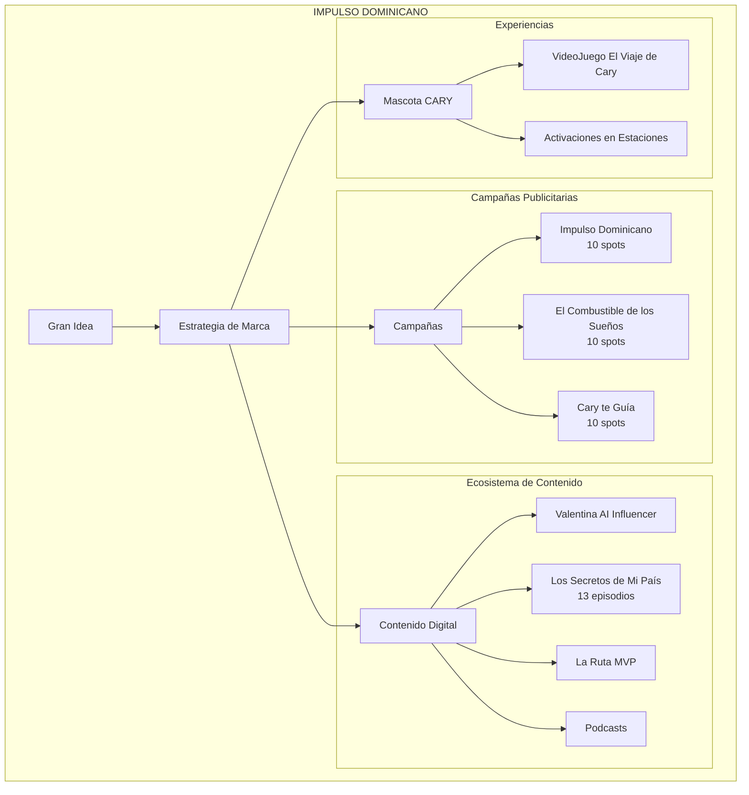
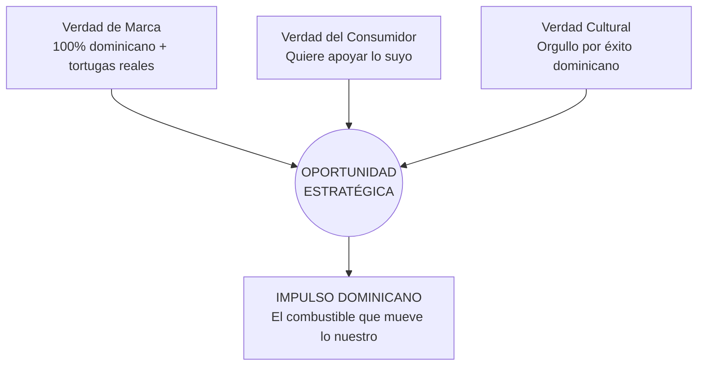
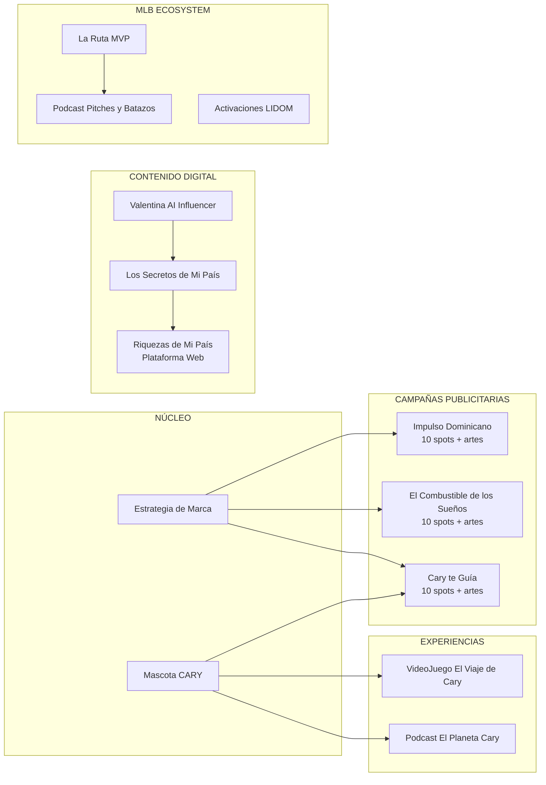
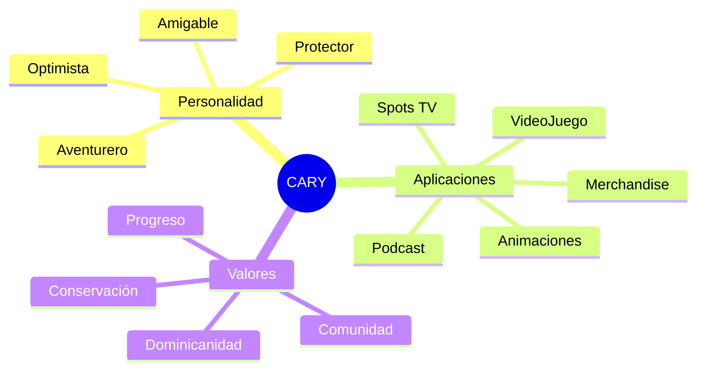
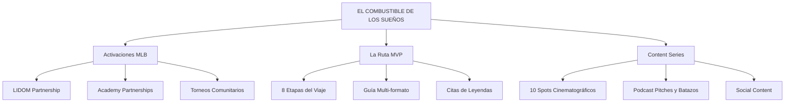
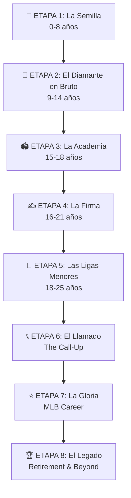
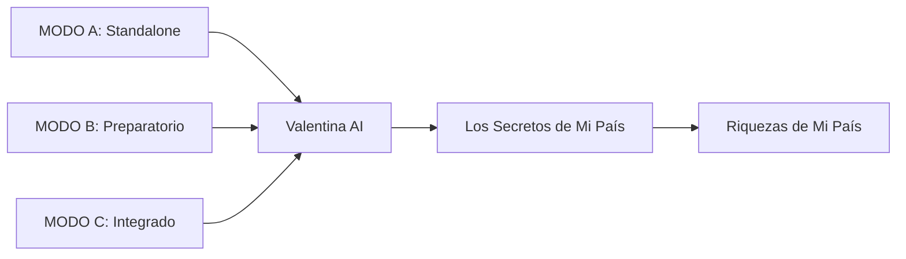
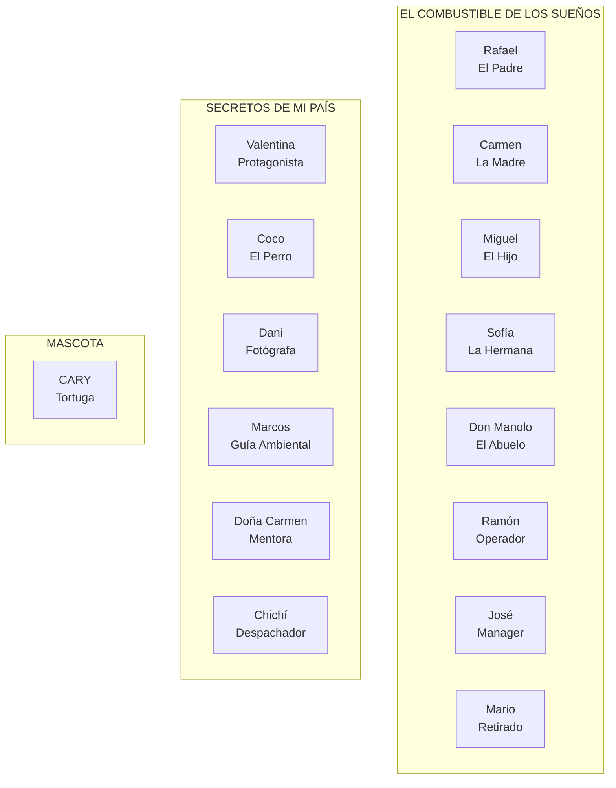
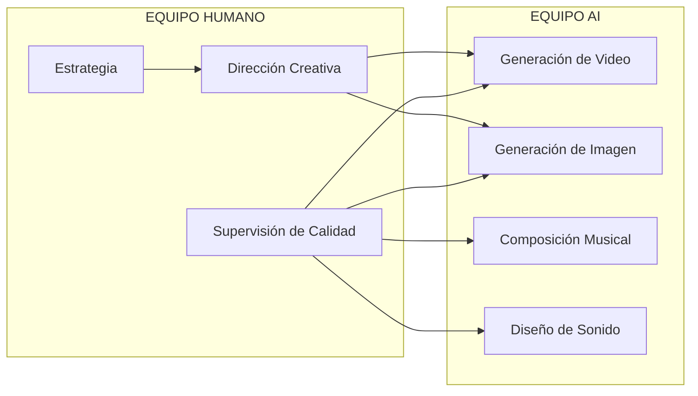

# "IMPULSO DOMINICANO"
## Propuesta Creativa de Mercadeo y Comunicación
### Ecopetróleo Dominicana

---

**Cliente**: Ecopetróleo Dominicana
**Agencia**: Xperto MediaMax
**Fecha**: Enero 2026
**Versión**: 2.0

---

# TABLA DE CONTENIDOS

1. Resumen Ejecutivo
2. Fundamento Estratégico
3. La Gran Idea
4. Manifiesto de Campaña
5. Arquitectura de la Solución
6. Componente 1: Estrategia de Marca — Reposicionamiento
7. Componente 2: Mascota de la Marca — "CARY"
8. Componente 3: Campaña de Anuncios — "Impulso Dominicano"
9. Componente 4: Campaña de Marketing MLB — "El Combustible de los Sueños"
10. Componente 5: Mini Campaña — "Cary te Guía"
11. Componente 6: La Ruta MVP
12. Componente 7: VideoJuego — "El Viaje de Cary"
13. Componente 8: Valentina, la Influencer AI
14. Componente 9: Serie — "Los Secretos de Mi País"
15. Componente 10: Podcasts
16. Personajes AI del Universo Ecopetróleo
17. Especificaciones de Piezas Creativas
18. Enfoque de Producción
19. Marco de KPIs y Medición
20. Resumen de Inversión
21. Evaluación y Mitigación de Riesgos
22. Por Qué Esto Ganará
23. Por Qué Xperto MediaMax
24. Anexos

---

# 1. RESUMEN EJECUTIVO

## 1.1 El Desafío

Ecopetróleo Dominicana es la única distribuidora de combustibles 100% dominicana con escala nacional y un programa de conservación ambiental real—pero nadie lo sabe. En un mercado de commodities donde el precio está regulado y todas las gasolinas vienen de la misma fuente, la marca ha crecido sin comunicar su diferenciador más poderoso.

Después de 15 años construyendo infraestructura, llegó el momento de construir significado.

## 1.2 La Oportunidad

**La paradoja de Ecopetróleo**: Una empresa llamada "Eco" con un logo de tortuga marina que protege tortugas marinas de verdad... y casi nadie lo sabe.

Esta no es solo una oportunidad de comunicación—es una oportunidad de crear una marca con propósito auténtico en una categoría dominada por corporaciones internacionales sin conexión emocional con el consumidor dominicano.

## 1.3 La Gran Idea

### "IMPULSO DOMINICANO"

> *El combustible que mueve lo nuestro*

Una plataforma de marca que conecta el acto cotidiano de llenar el tanque con el movimiento más grande de un país avanzando: sus familias, sus sueños, su naturaleza, sus jugadores de béisbol llegando a Grandes Ligas.

Porque en Ecopetróleo, cada tanque impulsa dos viajes: el tuyo y el de la República Dominicana hacia adelante.

## 1.4 La Solución

**Una campaña integrada de once componentes**:

| # | Componente | Descripción |
|---|------------|-------------|
| 1 | **Estrategia de Marca: Reposicionamiento** | Evolución de "distribuidora de combustibles" a "el combustible con propósito dominicano" |
| 2 | **Mascota de la Marca: "CARY"** | Tortuga carey animada—rostro y corazón de la marca |
| 3 | **Campaña de Anuncios: "Impulso Dominicano"** | 10 spots cinematográficos que revelan la historia no contada |
| 4 | **Campaña de Marketing MLB: "El Combustible de los Sueños"** | 10 spots + activaciones que conectan con el béisbol dominicano |
| 5 | **Mini Campaña: "Cary te Guía"** | 10 spots que posicionan la red de estaciones |
| 6 | **La Ruta MVP** | Guía inspiracional del viaje del pelotero dominicano en 8 etapas |
| 7 | **VideoJuego: "El Viaje de Cary"** | Roguelike oceánico para Steam/Switch |
| 8 | **Valentina, la Influencer AI** | Presencia en redes sociales con contenido auténtico |
| 9 | **Serie: "Los Secretos de Mi País"** | 13 episodios descubriendo destinos dominicanos |
| 10 | **Podcast Ambiental: "El Planeta Cary"** | Contenido de conservación y sostenibilidad |
| 11 | **Podcast de Béisbol: "Pitches y Batazos"** | Contenido deportivo conectado con MLB dominicano |

## 1.5 Impacto Esperado

| Dimensión | Proyección |
|-----------|------------|
| **Impacto de Negocio** | +10-15% tráfico en estaciones (12 meses) |
| **Impacto de Comunicación** | Top 5 brand recall, 40%+ awareness de programa ambiental |
| **Impacto Cultural** | Conversación nacional sobre marca dominicana con propósito |
| **Potencial de Premios** | Effie RD, Cannes Lions (Good category), Webby (Sustainability) |

## 1.6 Visualización de la Arquitectura



---

# 2. FUNDAMENTO ESTRATÉGICO

## 2.1 Resumen del Brief

| Elemento | Resumen |
|----------|---------|
| **Marca** | Ecopetróleo Dominicana |
| **Fundación** | 10 de septiembre de 2010 |
| **Estaciones** | 180+ a nivel nacional |
| **Diferenciador** | 100% dominicano + Programa real de conservación de tortugas |
| **Percepción Actual** | "Una de las distribuidoras dominicanas de gasolina" (indiferenciada) |
| **Target** | Conductores dominicanos 28-55, clase media, valoran autenticidad |

## 2.2 El Problema Estratégico

**La Verdad de la Categoría**: En un mercado de precio regulado donde todas las gasolinas vienen de la misma refinería, la diferenciación solo puede venir de lo que la marca representa—no del producto.

**La Verdad de la Marca**: Ecopetróleo tiene los assets de marca para diferenciarse (nombre + logo + programa real) pero no los ha activado comunicacionalmente.

**La Verdad Humana**: El consumidor dominicano quiere apoyar lo suyo—pero necesita una razón emocional para elegir una marca de gasolina sobre otra.

## 2.3 El Insight Estratégico

> **"En un país que exporta sueños a las Grandes Ligas, el combustible es más que gasolina—es lo que impulsa el viaje de cada dominicano hacia adelante."**

Este insight conecta:

- El orgullo nacional por el éxito dominicano (especialmente en béisbol)
- El concepto universal de "viaje" y progreso
- El rol literal del combustible como enabler de movimiento
- El compromiso ambiental como cuidado del territorio del viaje

## 2.4 La Intersección Estratégica



## 2.5 Esencia del Público Objetivo

**"Miguel"** — El conductor dominicano que trabaja duro, sueña en grande, y quiere sentir que sus decisiones cotidianas contribuyen a algo mayor que una transacción.

**Lo que Miguel quiere sentir**: Que su tanque de gasolina es una pequeña inversión en el progreso de su familia y su país.

---

# 3. LA GRAN IDEA

## 3.1 Declaración del Concepto

# "IMPULSO DOMINICANO"

### El combustible que mueve lo nuestro

## 3.2 Explicación del Concepto

"Impulso Dominicano" es más que un tagline—es una plataforma de marca que redefine lo que significa llenar el tanque en una estación Ecopetróleo.

La palabra **"impulso"** captura múltiples significados:

| Dimensión | Significado |
|-----------|-------------|
| **El impulso físico** | El combustible que mueve vehículos |
| **El impulso emocional** | La motivación que mueve a las personas |
| **El impulso nacional** | El momentum de un país en progreso |
| **El impulso natural** | La fuerza que guía a las tortugas marinas de regreso a casa |

**"Lo nuestro"** abarca:

- Nuestras familias que llevamos a la escuela y al trabajo
- Nuestras playas que protegemos
- Nuestros sueños de béisbol desde canchas de tierra hasta Grandes Ligas
- Nuestra empresa que es 100% dominicana

## 3.3 Por Qué Esta Idea es Poderosa

### Alineación Estratégica

- Amplifica el diferenciador de marca (100% dominicano + conservación real)
- Transforma un commodity en una decisión con propósito
- Crea territorio propio imposible de copiar por competidores internacionales

### Resonancia Emocional

- Conecta con el orgullo dominicano sin caer en folclorismo
- Eleva una decisión cotidiana a acto de contribución
- Crea sentido de comunidad y movimiento colectivo

### Relevancia Cultural

- Habla el lenguaje del "echando pa'lante" dominicano
- Se ancla en la pasión nacional por el béisbol
- Conecta mar, playa y tortugas con identidad caribeña

### Diferenciación Competitiva

- Ninguna marca internacional puede reclamar "lo nuestro"
- El programa de tortugas es un proof point único e inimitable
- 15 años de historia auténtica respaldan el mensaje

## 3.4 Validación de los Ocho Estándares de Henrik

| Estándar | Evaluación | Notas |
|----------|------------|-------|
| **Estratégica** | ✓ | Amplifica posicionamiento diferenciador |
| **Simple** | ✓ | "El combustible que mueve lo nuestro" — 6 palabras |
| **Escalable** | ✓ | Funciona en TV, digital, OOH, activaciones, MLB |
| **Memorable** | ✓ | "Impulso Dominicano" es pegadizo y único |
| **Propia** | ✓ | Solo Ecopetróleo puede reclamarlo auténticamente |
| **Emocional** | ✓ | Orgullo, progreso, pertenencia |
| **Accionable** | ✓ | "Llena en Ecopetróleo, impulsa lo nuestro" |
| **Craftful** | ✓ | Tortuga, mar, viaje, béisbol = sistema visual rico |

---

# 4. MANIFIESTO DE CAMPAÑA

## 4.1 Visión Creativa

*Lo leemos en voz de un dominicano común—no un locutor, un padre de familia, alguien real.*

---

**MANIFIESTO: IMPULSO DOMINICANO**

Hay un viaje que empieza todos los días.

En la guagua que lleva a los muchachos a la escuela.
En el carro del vendedor que cubre su ruta de Santiago a La Vega.
En el motor del delivery que cruza el tráfico de Santo Domingo.
En la camioneta que lleva al prospecto de 16 años a la academia.

Cada viaje es un acto de fe.
Fe en el próximo día.
Fe en el próximo cliente.
Fe en el próximo sueño.

Nosotros somos Ecopetróleo.
Nacimos aquí. Crecimos aquí. Servimos aquí.
100% dominicanos por 15 años.

Y entendemos que el combustible es más que gasolina.
Es lo que impulsa a un país hacia adelante.

Por eso cuidamos lo nuestro.
Protegemos las tortugas marinas que regresan a nuestras playas cada año.
Porque ellas también conocen el viaje largo.
Ellas también conocen el impulso de volver a casa.

Cada tanque que llenas en Ecopetróleo impulsa tu viaje
y el viaje de República Dominicana.

**IMPULSO DOMINICANO**
*El combustible que mueve lo nuestro.*

---

## 4.2 Principios Rectores

### Lo Que Esta Campaña ES

| Principio | Descripción |
|-----------|-------------|
| **Auténtico** | Basado en acciones reales, no en promesas vacías |
| **Optimista** | Celebra el progreso, no lamenta los problemas |
| **Inclusivo** | Todos los dominicanos son parte del movimiento |
| **Visual** | La tortuga, el mar, el viaje son lenguaje universal |
| **Emocional** | Mueve el corazón antes de mover la mente |

### Lo Que Esta Campaña NO ES

| Anti-principio | Por qué evitamos |
|----------------|------------------|
| **NO predicador** | No sermoneamos sobre medio ambiente |
| **NO folclórico** | No caemos en clichés de plátanos y merengue |
| **NO competitivo** | No atacamos a otras marcas |
| **NO corporativo** | No hablamos de "excelencia operacional" |
| **NO exagerado** | No prometemos lo que no podemos cumplir |

---

# 5. ARQUITECTURA DE LA SOLUCIÓN

## 5.1 Ecosistema Completo



## 5.2 Resumen de Componentes

| Componente | Tipo | Entregables Principales |
|------------|------|------------------------|
| **Estrategia de Marca** | Fundacional | Posicionamiento, identidad verbal, guías |
| **Mascota CARY** | Identidad | Diseño de personaje, guías de uso |
| **Campaña Impulso Dominicano** | Publicidad | 10 spots + vallas + digital + social |
| **Campaña El Combustible de los Sueños** | Publicidad/MLB | 10 spots + vallas + digital + social |
| **Mini Campaña Cary te Guía** | Publicidad | 10 spots + vallas + digital + social |
| **La Ruta MVP** | Contenido | Guía multi-formato, web, PDF |
| **VideoJuego El Viaje de Cary** | Experiencia | Game design, desarrollo |
| **Valentina AI Influencer** | Social Media | Presencia en redes, contenido diario |
| **Los Secretos de Mi País** | Serie Video | 13 episodios, plataforma web |
| **Podcast El Planeta Cary** | Audio | 12 episodios/año |
| **Podcast Pitches y Batazos** | Audio | 52 episodios/año |

---

# 6. COMPONENTE 1: ESTRATEGIA DE MARCA — REPOSICIONAMIENTO

## 6.1 Evolución de Arquitectura de Marca

### De:

```
Ecopetróleo = Distribuidora de combustibles dominicana
(Funcional, commodity, indiferenciada)
```

### A:

```
Ecopetróleo = El combustible que impulsa lo nuestro
(Emocional, con propósito, diferenciada)
```

## 6.2 Declaración de Posicionamiento

**Para** conductores dominicanos que quieren sentir que sus decisiones cotidianas contribuyen al progreso del país,

**Ecopetróleo** es la marca de combustibles que entiende y apoya lo que significa ser dominicano,

**Porque** somos 100% capital dominicano, nacimos de detallistas para detallistas, y protegemos activamente nuestras playas y tortugas marinas—no como promesa, sino como acción verificable.

## 6.3 Pilares de Marca

| Pilar | Significado | Proof Point |
|-------|-------------|-------------|
| **RAÍCES** | Nacimos aquí, crecimos aquí | 100% capital dominicano por 15 años |
| **COMPROMISO** | Nuestro logo es nuestra promesa | Programa de tortugas marinas con Medio Ambiente |
| **PROGRESO** | Impulsamos hacia adelante | 180+ estaciones de detallistas empoderados |
| **TRANSPARENCIA** | Somos diferentes por diseño | Modelo cooperativo original |

## 6.4 Sistema de Taglines

| Nivel | Tagline | Uso |
|-------|---------|-----|
| **Principal** | "Impulso Dominicano" | Branding general |
| **Secundario** | "El combustible que mueve lo nuestro" | Cierre de spots |
| **Terciario** | "Cada satisfacción empieza con un impulso" | Estaciones/Retail |
| **MLB** | "El combustible de los sueños" | Campaña béisbol |
| **Estaciones** | "Siempre hay una Ecopetróleo en tu camino" | Mini campaña Cary |

---

# 7. COMPONENTE 2: MASCOTA DE LA MARCA — "CARY"

## 7.1 Concepto del Personaje

**Nombre**: Cary (derivado de "carey", la especie de tortuga del logo)

**Especie**: Tortuga carey (*Eretmochelys imbricata*)

**Personalidad**: Amigable, aventurero, protector, orgullosamente dominicano

## 7.2 Perfil de Cary

| Atributo | Descripción |
|----------|-------------|
| **Edad aparente** | Adulto joven (equivalente a 25-30 años humanos) |
| **Personalidad** | Optimista, curioso, protector de su hogar |
| **Voz** | Cálida, accesible, como un amigo |
| **Motivación** | Proteger los océanos mientras ayuda a los viajeros dominicanos |
| **Frase característica** | "¡Pa'lante con impulso!" |

## 7.3 Aplicaciones de Cary

| Aplicación | Descripción |
|------------|-------------|
| **Spots publicitarios** | Protagonista de mini campaña "Cary te Guía" |
| **Animaciones digitales** | Stickers, GIFs, filtros de redes sociales |
| **Señalética** | Presente en estaciones de servicio |
| **Merchandise** | Peluches, camisetas, artículos promocionales |
| **VideoJuego** | Protagonista de "El Viaje de Cary" |
| **Podcast** | Host de "El Planeta Cary" |
| **Educativo** | Material para escuelas sobre conservación |

## 7.4 Visualización del Personaje



---

# 8. COMPONENTE 3: CAMPAÑA DE ANUNCIOS — "IMPULSO DOMINICANO"

## 8.1 Concepto de Campaña

**Nombre**: Impulso Dominicano

**Tipo**: Brand Awareness + Emotional Positioning

**Objetivo**: Revelar la historia no contada de Ecopetróleo—conectando tortuga, mar, viaje y progreso dominicano

## 8.2 Los 10 Spots

| # | Título | Duración | Concepto |
|---|--------|----------|----------|
| 1 | **"El Regreso"** | 90" | Hero spot: paralelo entre tortuga regresando y familia regresando a casa |
| 2 | **"15 Años"** | 60" | Historia de Ecopetróleo contada a través de una estación |
| 3 | **"El Viaje"** | 60" | Montaje de diferentes viajes impulsados por Ecopetróleo |
| 4 | **"Nuestras Playas"** | 45" | Programa de conservación de tortugas |
| 5 | **"Madrugada"** | 45" | El país despertando, moviéndose |
| 6 | **"La Red"** | 30" | 180+ estaciones conectando el país |
| 7 | **"Generaciones"** | 45" | Abuelo y nieto en viaje |
| 8 | **"El Tanque"** | 30" | Lo que significa un tanque lleno |
| 9 | **"Dominicano"** | 60" | Declaración de identidad |
| 10 | **"Impulso"** | 30" | Spot de cierre conceptual |

## 8.3 Piezas Creativas Incluidas

Para cada spot se desarrollan:

| Pieza | Especificación |
|-------|----------------|
| **Video spot** | 30" a 90" según el spot |
| **Cutdowns** | Versiones 15" para digital |
| **Vallas** | Arte principal + variaciones |
| **Publicidad digital** | Banners, pre-rolls |
| **Social media** | Posts + Stories adaptados |

---

# 9. COMPONENTE 4: CAMPAÑA DE MARKETING MLB — "EL COMBUSTIBLE DE LOS SUEÑOS"

## 9.1 Concepto de Campaña

**Nombre**: El Combustible de los Sueños

**Insight Central**:

> "Detrás de cada pelotero dominicano en Grandes Ligas hay miles de galones de gasolina: los viajes a las academias, los torneos de pueblo, los padres que manejaron horas para que su hijo tuviera una oportunidad."

## 9.2 Los 10 Spots

| # | Título | Duración | Concepto |
|---|--------|----------|----------|
| 1 | **"El Sábado (Padre)"** | 90" | Hero: Padre lleva al hijo al torneo de pueblo |
| 2 | **"El Sábado (Madre)"** | 90" | Hero: Perspectiva de la madre apoyando |
| 3 | **"Los Guantes Heredados"** | 60" | Tres generaciones, un par de guantes |
| 4 | **"El Tryout"** | 60" | El día que define todo |
| 5 | **"La Hermana Scout"** | 45" | Ella lo vio primero |
| 6 | **"5:30 AM"** | 30" | La madrugada del sueño |
| 7 | **"El Manager"** | 30" | Quien construye campeones |
| 8 | **"El Pelotero Retirado"** | 30" | El legado continúa |
| 9 | **"La Racha"** | 30" | La superstición del dominicano |
| 10 | **"El Call-Up"** | 45" | El momento que cambia todo |

## 9.3 Estructura de Tres Pilares



---

# 10. COMPONENTE 5: MINI CAMPAÑA — "CARY TE GUÍA"

## 10.1 Concepto de Campaña

**Nombre**: Cary te Guía: Siempre hay una Ecopetróleo en tu camino

**Objetivo**: Posicionar la red de estaciones como accesible y confiable, usando a Cary como guía

**Tono**: Ligero, amigable, funcional con corazón

## 10.2 Los 10 Spots

| # | Título | Duración | Concepto |
|---|--------|----------|----------|
| 1 | **"Bienvenido"** | 30" | Cary da la bienvenida a la red |
| 2 | **"Norte a Sur"** | 30" | Cobertura nacional |
| 3 | **"La Carretera"** | 30" | Siempre cerca en tu viaje |
| 4 | **"El Desvío"** | 30" | Encontrando estaciones inesperadas |
| 5 | **"Lluvia"** | 30" | Refugio y servicio |
| 6 | **"Madrugada"** | 30" | Abiertos cuando necesitas |
| 7 | **"La Familia"** | 30" | Viaje familiar |
| 8 | **"El Trabajador"** | 30" | Para el que trabaja temprano |
| 9 | **"Fin de Semana"** | 30" | Escapadas y aventuras |
| 10 | **"Gracias"** | 30" | Agradecimiento al cliente |

## 10.3 Rol de Cary

En esta campaña, Cary aparece como:

- **Narrador animado** que guía al espectador
- **Elemento visual** que señala las estaciones
- **Personaje** que interactúa con conductores (animación + live action)
- **Ícono** en transiciones y cierres

---

# 11. COMPONENTE 6: LA RUTA MVP

## 11.1 Concepto

**Nombre**: La Ruta MVP — El Mapa del Sueño Dominicano en el Béisbol

**Descripción**: Guía inspiracional y práctica que documenta el viaje completo del pelotero dominicano, desde la primera vez que agarra un bate hasta el Salón de la Fama.

## 11.2 Las 8 Etapas



## 11.3 Contenido por Etapa

Cada etapa incluye:

| Elemento | Descripción |
|----------|-------------|
| **Descripción** | Qué sucede en esta fase |
| **Citas de leyendas** | David Ortiz, Pedro Martínez, Juan Soto, etc. |
| **Anécdotas reales** | Historias inspiradoras |
| **Lecciones** | Qué se aprende |
| **El Rol del Combustible** | Conexión con Ecopetróleo |

## 11.4 Formatos de Entrega

| Formato | Descripción |
|---------|-------------|
| **Web/App** | Plataforma interactiva larutamvp.com |
| **PDF** | Guía descargable (80-100 páginas) |
| **Impreso** | Libro físico para academias/estadios |
| **Pocket** | Versión 24-32 páginas para estaciones |
| **Video** | Serie "El Viaje de..." |
| **Podcast** | Episodios especiales en Pitches y Batazos |

---

# 12. COMPONENTE 7: VIDEOJUEGO — "EL VIAJE DE CARY"

## 12.1 Concepto del Juego

**Título**: El Viaje de Cary: Guardián del Caribe

**Género**: Roguelike de aventura oceánica

**Plataformas**: Steam (PC/Mac) + Nintendo Switch

**Target**: Todas las edades, familiar

## 12.2 Gameplay

| Elemento | Descripción |
|----------|-------------|
| **Protagonista** | Cary, la tortuga carey |
| **Objetivo** | Navegar los océanos, proteger ecosistemas, sobrevivir amenazas |
| **Mecánicas** | Exploración, recolección, evasión de peligros, protección de otras tortugas |
| **Mensaje** | Conservación ambiental implícita, no predicadora |
| **Diversión** | Primero entretenimiento, segundo mensaje |

## 12.3 Por Qué un VideoJuego

| Razón | Beneficio |
|-------|-----------|
| **Engagement** | Más allá de publicidad tradicional |
| **Audiencia joven** | Conexión con generaciones digitales |
| **Brand affinity** | Tiempo de exposición prolongado |
| **PR** | "Una empresa de combustible hizo un juego sobre tortugas" |
| **Revenue** | No solo costo, potencial de ingresos |

---

# 13. COMPONENTE 8: VALENTINA, LA INFLUENCER AI

## 13.1 Concepto

**Nombre**: Valentina Durán

**Handle**: @valentina.duran.rd

**Edad**: 27 años

**Descripción**: AI Influencer dominicana que promueve el país a través de contenido auténtico, personal y creativo en redes sociales.

## 13.2 Regla de Oro

> **"Valentina primero. Marca segundo."**
>
> El contenido de Valentina NUNCA debe sentirse como publicidad. Ecopetróleo es el patrocinador que hace posible sus aventuras, no el tema de su contenido.

## 13.3 Pilares de Contenido

| Pilar | % | Descripción |
|-------|---|-------------|
| **DESCUBRIR** | 40% | Lugares, destinos, secretos de RD |
| **VIVIR** | 25% | Vida cotidiana, aventuras, Coco |
| **CONECTAR** | 15% | Gente, historias, comunidad |
| **INSPIRAR** | 10% | Reflexiones, motivación |
| **EDUCAR** | 10% | Historia, datos, conservación |

## 13.4 Modos de Operación



| Modo | Descripción |
|------|-------------|
| **A: Standalone** | Opera independientemente como influencer |
| **B: Preparatorio** | Construye audiencia antes de lanzar la serie |
| **C: Integrado** | Parte del ecosistema completo con serie y plataforma |

---

# 14. COMPONENTE 9: SERIE — "LOS SECRETOS DE MI PAÍS"

## 14.1 Concepto

**Nombre**: Los Secretos de Mi País

**Protagonista**: Valentina Durán (y su perro Coco)

**Formato**: 13 episodios por temporada, 20-25 minutos cada uno

**Plataforma**: YouTube + Redes sociales + Web dedicada

## 14.2 Los 13 Episodios (Temporada 1)

| # | Título | Destino | Región |
|---|--------|---------|--------|
| 1 | El Hoyo del Volcán | El Mogote | Cibao |
| 2 | El Pueblo que el Tiempo Olvidó | San José de las Matas | Cibao |
| 3 | La Catedral del Mar | Cueva de las Golondrinas | Samaná |
| 4 | El Río que Nace del Cielo | Salto Aguas Blancas | Constanza |
| 5 | La Isla de los Náufragos | Cayo Arena | Puerto Plata |
| 6 | El Valle de los Colores | Valle Nuevo | Cordillera Central |
| 7 | Los Fantasmas de las Salinas | Salinas de Baní | Sur |
| 8 | El Secreto de los Taínos | Cuevas del Pomier | Sur |
| 9 | El Pueblo Bajo el Agua | Lago Enriquillo | Suroeste |
| 10 | La Montaña Sagrada | Pico Duarte | Cordillera Central |
| 11 | Los Guardianes del Arrecife | La Caleta | Sur |
| 12 | El Año de los Secretos | Retrospectiva | Nacional |
| 13 | El Río que Se Esconde | Río Partido | Norte |

## 14.3 Conexión con Plataforma "Riquezas de Mi País"

La serie alimenta la plataforma web/móvil "Riquezas de Mi País" que incluye:

- Información detallada de 50+ destinos
- Rutas pre-calculadas con estaciones Ecopetróleo
- Calculadora de combustible
- Comunidad de viajeros
- Guías descargables

---

# 15. COMPONENTE 10: PODCASTS

## 15.1 Podcast Ambiental: "El Planeta Cary"

| Atributo | Descripción |
|----------|-------------|
| **Host** | Cary (voz animada) + expertos invitados |
| **Frecuencia** | Mensual (12 episodios/año) |
| **Duración** | 20-30 minutos |
| **Contenido** | Conservación marina, tortugas, medio ambiente |
| **Tono** | Educativo pero accesible, no predicador |

### Temas de Episodios

| # | Tema |
|---|------|
| 1 | El regreso de las tortugas carey |
| 2 | Los océanos dominicanos |
| 3 | Plástico y soluciones |
| 4 | Héroes de la conservación |
| 5 | El ciclo de la vida marina |
| 6 | Playas limpias |
| 7-12 | (Continúa...) |

## 15.2 Podcast de Béisbol: "Pitches y Batazos"

| Atributo | Descripción |
|----------|-------------|
| **Host** | Comentarista deportivo + invitados |
| **Frecuencia** | Semanal (52 episodios/año) |
| **Duración** | 45-60 minutos |
| **Contenido** | Béisbol dominicano, MLB, historias |
| **Tono** | Apasionado, informativo, cercano |

### Formatos de Episodio

| Tipo | Frecuencia |
|------|------------|
| **Entrevista** | 2x/mes con jugadores/leyendas |
| **Análisis** | 1x/semana de temporada |
| **La Ruta MVP Especial** | 1x/mes profundizando en etapas |
| **Histórico** | 1x/mes recordando momentos |

---

# 16. PERSONAJES AI DEL UNIVERSO ECOPETRÓLEO

## 16.1 Por Qué Personajes AI

| Ventaja | Explicación |
|---------|-------------|
| **Control total** | Edad, emoción, actividad, vestimenta siempre consistentes |
| **Disponibilidad** | Siempre disponibles, sin conflictos de agenda |
| **Consistencia** | Mantienen la misma apariencia a través del tiempo |
| **Flexibilidad** | Pueden aparecer en cualquier escenario |
| **Sin riesgos** | No hay escándalos o controversias |
| **Costo-efectivo** | Una vez creados, uso ilimitado |

## 16.2 Personajes para "El Combustible de los Sueños"

| Personaje | Rol | Descripción |
|-----------|-----|-------------|
| **Rafael** | El Padre | 42 años, trabajador, dedicado a la familia, sueña con el éxito de su hijo |
| **Carmen** | La Madre | 40 años, fuerte, el pilar de la familia, apoya incondicionalmente |
| **Miguel** | El Hijo | 14 años, prospecto de béisbol, talentoso y disciplinado |
| **Sofía** | La Hermana | 17 años, primera en ver el talento de Miguel, scout de corazón |
| **Don Manolo** | El Abuelo | 68 años, ex-pelotero amateur, transmite sabiduría |
| **Ramón** | Operador de Estación | 50 años, conoce a todos, testigo de historias |
| **José** | Manager de MiniLiga | 55 años, forjador de talentos, dedicado a los jóvenes |
| **Mario** | Jugador Retirado | 60 años, llegó a AAA, ahora devuelve a la comunidad |

## 16.3 Personajes para "Secretos de Mi País"

| Personaje | Rol | Descripción |
|-----------|-----|-------------|
| **Valentina** | Protagonista | 27 años, curiosa, aventurera, orgullosamente dominicana |
| **Coco** | El Perro | Potcake rescatado, compañero leal de Valentina |
| **Dani** | Amiga Fotógrafa | 26 años, captura los momentos, compañera de algunas aventuras |
| **Marcos** | Guía Ambiental | 35 años, conocedor de la naturaleza dominicana |
| **Doña Carmen** | Mentora Cultural | 65 años, guardiana de tradiciones, cuenta historias |
| **Chichí** | Despachador de Estación | 45 años, conoce todos los caminos, siempre tiene un tip |

## 16.4 Visualización del Universo de Personajes



---

# 17. ESPECIFICACIONES DE PIEZAS CREATIVAS

## 17.1 Piezas por Campaña

Cada una de las tres campañas incluye:

| Pieza | Cantidad | Especificación |
|-------|----------|----------------|
| **Videos spot** | 10 | 30" a 90" según guion |
| **Cutdowns** | 10 | Versión 15" de cada spot |
| **Artes vallas** | 20 | 2 variaciones por spot |
| **Publicidad digital** | 30 | Banners, pre-rolls, display |
| **Posts redes** | 30 | 3 por spot (diferentes formatos) |
| **Stories** | 50 | 5 por spot |

## 17.2 Total de Piezas Creativas

| Campaña | Videos | Vallas | Digital | Social |
|---------|--------|--------|---------|--------|
| **Impulso Dominicano** | 20 | 20 | 30 | 80 |
| **El Combustible de los Sueños** | 20 | 20 | 30 | 80 |
| **Cary te Guía** | 20 | 20 | 30 | 80 |
| **TOTAL** | **60** | **60** | **90** | **240** |

## 17.3 Especificaciones Técnicas

### Video

| Formato | Especificación |
|---------|----------------|
| **Resolución** | 4K (3840 x 2160) |
| **Frame rate** | 24fps (look cinematográfico) |
| **Aspect ratio TV** | 16:9 |
| **Aspect ratio Social** | 9:16, 1:1, 4:5 |
| **Audio** | Estéreo, música original |

### Vallas

| Formato | Tamaño |
|---------|--------|
| **Horizontal estándar** | 14' x 48' |
| **Vertical** | 10' x 30' |
| **Digital** | 1920 x 1080 px |

### Digital

| Formato | Tamaño |
|---------|--------|
| **Banner horizontal** | 728 x 90 px |
| **Banner cuadrado** | 300 x 250 px |
| **Skyscraper** | 160 x 600 px |
| **Pre-roll** | 1920 x 1080 px, 15" |

---

# 18. ENFOQUE DE PRODUCCIÓN

## 18.1 La Ventaja Xperto MediaMax

> **Mayor Calidad. Mitad del Costo. En un Tercio del Tiempo. Control Total. Posibilidades Infinitas.**

## 18.2 Los Cinco Pilares Aplicados

| Pilar | Aplicación a Esta Campaña |
|-------|---------------------------|
| **Mayor Calidad** | Estándares nivel festival (Sundance, Cannes) para cada pieza |
| **3× Más Rápido** | 30 spots + todo el contenido en 12 semanas vs. 36+ tradicional |
| **50% Menor Costo** | Eficiencias de AI + producción sistematizada |
| **100% Control** | Personajes AI = cambios sin re-filmación |
| **Posibilidades Infinitas** | 450+ piezas creativas del mismo sistema |

## 18.3 Modelo Híbrido Humano + AI



## 18.4 Stack Tecnológico

| Herramienta | Uso |
|-------------|-----|
| **Google Veo 3.1** | Generación de video |
| **MidJourney** | Generación de imágenes y referencias |
| **Suno AI** | Composición musical original |
| **Claude** | Orquestación, guiones, estrategia |
| **DaVinci Resolve** | Edición y post-producción |

---

# 19. MARCO DE KPIS Y MEDICIÓN

## 19.1 KPIs de Negocio

| KPI | Meta Año 1 | Meta Año 2 |
|-----|------------|------------|
| **Tráfico en estaciones** | +10% | +15% |
| **Market share** | +2 puntos | +4 puntos |
| **Ticket promedio** | +5% | +8% |

## 19.2 KPIs de Comunicación

| KPI | Meta Año 1 | Meta Año 2 |
|-----|------------|------------|
| **Brand awareness** | 60% | 75% |
| **Top of mind** | Top 5 | Top 3 |
| **Awareness programa tortugas** | 40% | 60% |
| **Asociación "dominicano"** | 70% | 85% |

## 19.3 KPIs de Contenido

| KPI | Meta |
|-----|------|
| **Views totales (año)** | 10M+ |
| **Engagement rate** | 5%+ |
| **Seguidores Valentina** | 150K+ |
| **Descargas La Ruta MVP** | 50K+ |
| **Podcast listens/episodio** | 5K+ |

## 19.4 KPIs de Impacto

| KPI | Meta |
|-----|------|
| **Menciones en medios** | 50+ |
| **Sentiment positivo** | 90%+ |
| **UGC generado** | 1000+ piezas |
| **Premios** | 2+ nominaciones |

---

# 20. RESUMEN DE INVERSIÓN

## 20.1 Inversión por Componente

| # | Componente | Inversión Estimada |
|---|------------|-------------------|
| 1 | Estrategia de Marca: Reposicionamiento | US$12,500 |
| 2 | Mascota de la Marca: CARY | US$15,000 |
| 3 | Campaña de Anuncios: Impulso Dominicano (10 spots + artes) | US$45,000 |
| 4 | Campaña MLB: El Combustible de los Sueños (10 spots + artes) | US$45,000 |
| 5 | Mini Campaña: Cary te Guía (10 spots + artes) | US$35,000 |
| 6 | La Ruta MVP (multi-formato) | US$25,000 |
| 7 | VideoJuego: El Viaje de Cary | US$8,500 |
| 8 | Valentina AI Influencer (12 meses) | US$85,000 |
| 9 | Serie: Los Secretos de Mi País (13 episodios) | US$65,000 |
| 10 | Podcast: El Planeta Cary (12 episodios) | US$12,000 |
| 11 | Podcast: Pitches y Batazos (52 episodios) | US$32,000 |
| | **SUBTOTAL PRODUCCIÓN** | **US$380,000** |
| | Activaciones MLB (variable) | US$60,000 - 350,000 |
| | Medios (12 meses, variable) | US$200,000 - 500,000 |

**Nota**: Los costos de producción optimizados mediante tecnología AI permiten resultados de nivel festival a una fracción del costo tradicional.

---

# 21. EVALUACIÓN Y MITIGACIÓN DE RIESGOS

## 21.1 Riesgos Creativos

| Riesgo | Probabilidad | Impacto | Mitigación |
|--------|--------------|---------|------------|
| Mensaje percibido como greenwashing | Media | Alto | Solo comunicar acciones verificadas; estilo documental |
| Fatiga de tortuga si se sobreusa | Media | Medio | Balancear con contenido de viaje; no hacer todo sobre tortugas |
| Partnership MLB cae | Baja | Medio | Backup con LIDOM y béisbol comunitario |
| Competidor copia mensaje | Media | Medio | Establecer primacía rápido; territorio con programa real |

## 21.2 Riesgos Operacionales

| Riesgo | Probabilidad | Impacto | Mitigación |
|--------|--------------|---------|------------|
| Problemas con temporada de tortugas | Media | Alto | Planificar grabaciones con anticipación |
| Embajador con controversia | Baja | Alto | Vetting riguroso; cláusula de moralidad |
| Exceso de presupuesto | Media | Medio | Scope claro; enfoque por fases; buffer de contingencia |

## 21.3 Riesgos Reputacionales

| Riesgo | Probabilidad | Impacto | Mitigación |
|--------|--------------|---------|------------|
| Incidente ambiental en estación | Baja | Muy Alto | Protocolo de crisis; respuesta rápida; transparencia |
| PR negativo sobre industria combustible | Media | Medio | Liderar con propósito; separar marca de commodity |
| Error cultural | Baja | Alto | Revisión creativa local; equipo creativo diverso |

---

# 22. POR QUÉ ESTO GANARÁ

## 22.1 Potencial de Premios

| Premio | Categoría | Fortaleza |
|--------|-----------|-----------|
| **Effie Awards** | Sustained Success, Social Good | Objetivos claros + impacto ambiental + relevancia dominicana |
| **Cannes Lions** | SDGs, Entertainment Lions | Integración auténtica de propósito, calidad de storytelling |
| **Webby Awards** | Sustainability, Branded Content | Contenido digital-first, engagement social |

## 22.2 El Triple Win

| Stakeholder | Ganancia |
|-------------|----------|
| **Cliente (Ecopetróleo)** | Posición diferenciada, preferencia aumentada, historia auténtica |
| **Consumidor (conductor dominicano)** | Marca que lo representa, propósito en compra, orgullo en elección |
| **Sociedad (medio ambiente)** | Impacto real de conservación, awareness de vida marina |

## 22.3 Foso Competitivo

Ningún competidor puede copiar esta campaña porque:

1. **No son dominicanos**: TotalEnergies, Shell, Texaco son marcas internacionales
2. **No tienen tortugas**: Nadie más tiene programa de conservación con el gobierno
3. **No tienen 15 años**: La historia de Ecopetróleo es auténtica y verificable
4. **No tienen el nombre**: "Eco" + "Petróleo" = naming perfecto para el mensaje

---

# 23. POR QUÉ XPERTO MEDIAMAX

## 23.1 La Ventaja Xperto

> **Mayor Calidad. Mitad del Costo. En un Tercio del Tiempo. Control Total. Posibilidades Infinitas.**

## 23.2 Comparación con Producción Tradicional

| Factor | Enfoque Tradicional | Enfoque Xperto MediaMax |
|--------|---------------------|-------------------------|
| **Calidad** | Equipo limitado | Equipo profesional completo |
| **Tiempo** | 2-3 semanas por video | Campaña completa en 12 semanas |
| **Costo** | $15K+ por video | ~50% a través de eficiencia sistémica |
| **Control** | Limitado post-filmación | Continuo incluso después de entrega |
| **Escala** | Aumento lineal de costo | Costo incremental mínimo |
| **Cambios** | Re-grabaciones costosas | Incluidos en el proceso |
| **Música** | Tarifas de licenciamiento | Original, libre de regalías |

## 23.3 Experiencia Comprobada

| Proyecto | Cliente | Resultado |
|----------|---------|-----------|
| **35 Días de MagIA** | Juguetón | 35 comerciales en 35 días, 7 personajes, calidad festival |
| **Corporativo ADOCOSE** | ADOCOSE | Producción institucional de alta calidad |
| **Cámara Franco-Dominicana** | CCIFRD | Comunicación corporativa con excelencia cinematográfica |

## 23.4 La Promesa Xperto

> "La mayor magia no está en nuestras herramientas o tecnología; está en nuestra capacidad de entender y amplificar imaginativamente el potencial infinito de ideas y emociones. Esa es nuestra promesa, nuestro compromiso y nuestra pasión."

---

# 24. ANEXOS

## Anexo A: Referencias Visuales

**Estética de Campaña**: Autenticidad documental con calidez caribeña

**Referencias Visuales**:

- BBC "Blue Planet II" — secuencias submarinas de tortugas
- Apple "Shot on iPhone" — personas reales, momentos reales
- Cerveza Presidente — autenticidad dominicana
- Nike "You Can't Stop Us" — técnica de edición paralela
- ESPN 30 for 30 — craft documental deportivo

## Anexo B: Programa de Conservación de Tortugas

**Nombre Oficial**: [A confirmar con cliente]

**Socio**: Ministerio de Medio Ambiente y Recursos Naturales

**Geografía**: Playa Los Pescadores a Playa Güibia

**Actividades**:
- Patrullaje diurno y nocturno
- Marcaje y protección de nidos
- Monitoreo de anidación
- Reducción de plásticos
- Restauración de ecosistemas costeros

**Especies Protegidas**:
- Chelonia mydas (tortuga verde)
- Dermochelys coriacea (tortuga tinglar)
- Eretmochelys imbricata (carey)

## Anexo C: Contexto MLB República Dominicana

**Datos Clave**:

- 10%+ de rosters MLB son dominicanos
- 30 equipos MLB tienen academias en RD
- Dominican Summer League opera desde 1985
- LIDOM es una de las ligas invernales más competitivas
- República Dominicana ha ganado 22+ veces la Serie del Caribe

## Anexo D: Documentos Relacionados

| Documento | Descripción |
|-----------|-------------|
| `el-combustible-de-los-suenos.md` | Estrategia completa campaña MLB |
| `la-ruta-mvp.md` | Guía de 8 etapas del pelotero dominicano |
| `secretos-de-mi-pais.md` | Biblia de la serie con Valentina |
| `riquezas-de-mi-pais.md` | Especificación de plataforma web |
| `valentina-ai-influencer.md` | Perfil completo de Valentina |
| `ecopetroleo-website-specification.md` | Especificación del sitio de presentación |

---

## Metadatos de la Propuesta

| Campo | Valor |
|-------|-------|
| **Preparado Por** | Xperto MediaMax |
| **Fecha** | Enero 2026 |
| **Versión** | 2.0 |
| **Tipo de Propuesta** | Completa |
| **Tipo de Campaña** | Branding + Advertising + Sports Partnership + Content |
| **Basado en Brief** | Ecopetróleo Comprehensive Brand Brief v1.0 |
| **Válido Hasta** | Marzo 2026 |

---

## Historial del Documento

| Versión | Fecha | Cambios |
|---------|-------|---------|
| 1.0 | 2026-01-28 | Propuesta inicial |
| 2.0 | 2026-01-30 | Actualización completa: 11 componentes, personajes AI, piezas creativas detalladas, diagramas Mermaid |

---

*Propuesta Creativa Completa v2.0 | Xperto MediaMax*

---

**"Gran idea es simple de explicar, imposible de olvidar, y mueve el negocio."**
*— Henrik Bergström-García, Director Creativo*

---

# SIGUIENTE PASO

Para avanzar con "Impulso Dominicano", recomendamos:

1. **Reunión de Validación**: Presentar este documento al equipo Ecopetróleo
2. **Discovery Session**: Completar información faltante del brief
3. **Scope Definition**: Definir presupuesto y alcance específico
4. **Contrato**: Formalizar acuerdo de servicios
5. **Kick-off**: Iniciar Fase 1 — Foundation

---

**IMPULSO DOMINICANO**
*El combustible que mueve lo nuestro*

🐢 🇩🇴 ⚾ 🚗
